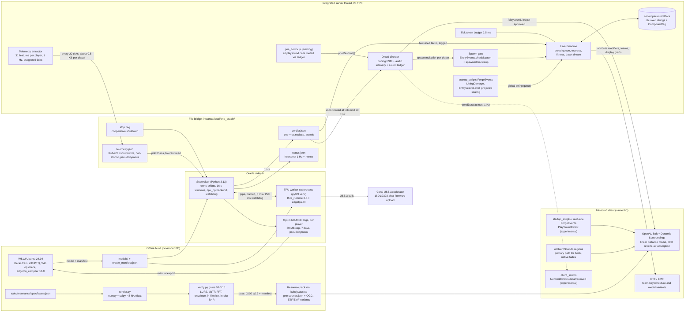
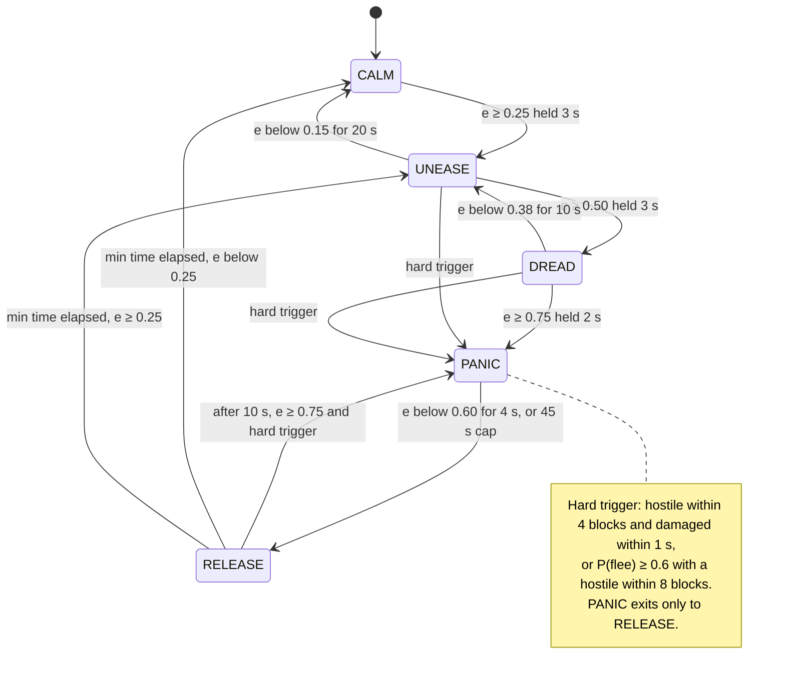
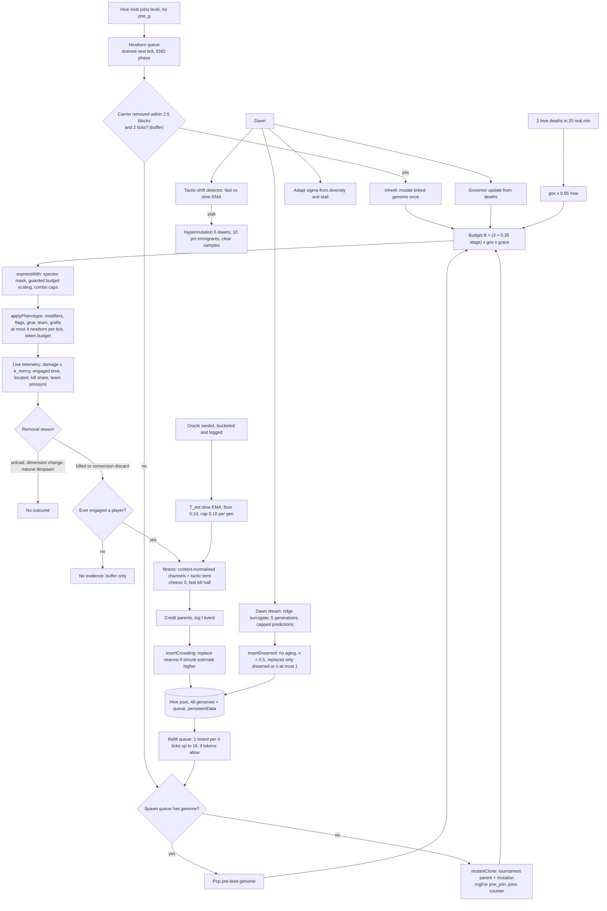
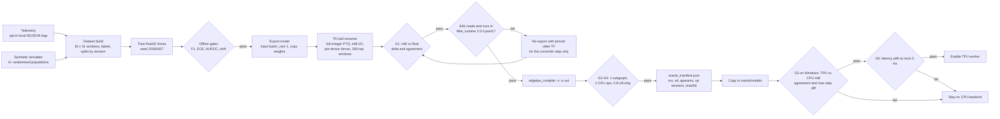
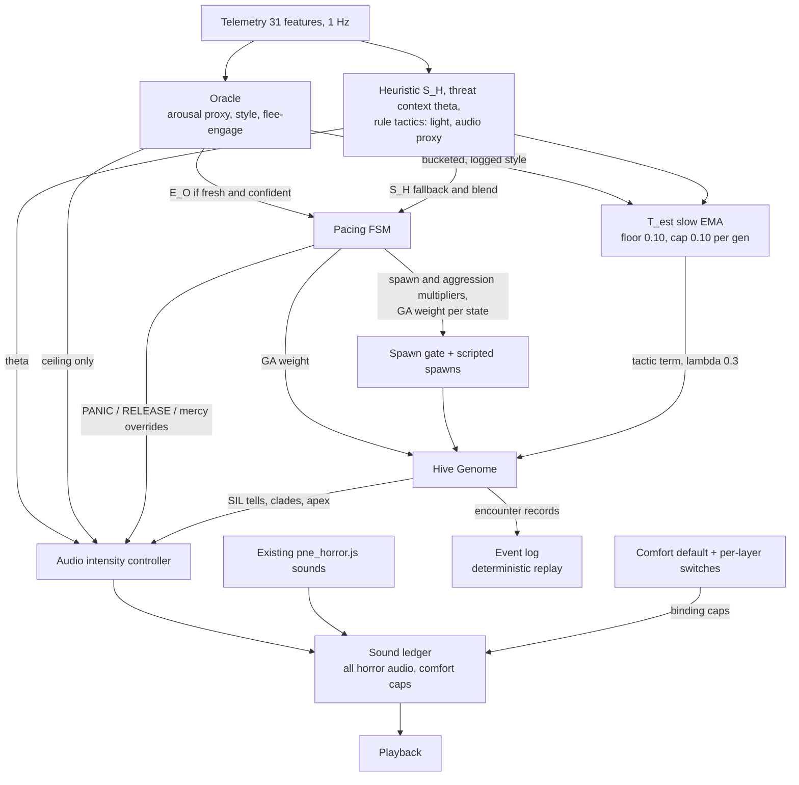

# The Hive Remembers: Psychoacoustic Dread, Evolving Parasites and Edge-TPU Profiling

Technical Design Document, v1.1 · 2026-09-27

## 0. Executive summary

We are building three coupled systems for a horror-first Minecraft modpack whose enemies come from two allied parasite mods, EPCA and Spore. Each system is also specified so it can move to a standalone engine.

1. **The Resonance** (audio). A Python DSP pipeline renders every new horror sound procedurally from a machine-readable spec. It then measures each decoded file (BS.1770-4 loudness, 4x-oversampled true peak, FFT spectrum, Hilbert envelope, in-file level rise) and fails the build if a file is off spec. A server-side **dread director** has two parts:
   - A **pacing FSM** (CALM → UNEASE → DREAD → PANIC → RELEASE) driven by a fused behavioural-arousal estimate. It controls spawns, aggression and PANIC/RELEASE.
   - An **audio intensity controller** driven by *threat context* (proximity, count, darkness). The arousal estimate acts only as a *ceiling* on it.
   - Every horror sound in the pack, old and new, goes through one per-player ledger that enforces duty caps, level-jump limits and comfort rules. Dread comes from uncertainty, presence, pareidolia and looming, not from physical discomfort.
2. **The Hive Genome** (enemies). Every parasite spawns with a 14-gene genome, and its encounters with players are scored as fitness. One hive-wide pool evolves through a deterministic, niching, steady-state genetic algorithm. Observed player tactics bias selection toward counters, and players who are weakened or just respawned give no fitness credit at all. The phenotype is expressed through what Minecraft allows: attribute modifiers, NBT flags, equipment, scripted mechanics, scoreboard-team texture variants and display-entity "grafts". The GA core is plain ES5 and gives bit-identical results in Node and in KubeJS's Rhino fork (**measured**).
3. **The Oracle** (player profiling). A small multitask MLP (496→64→32→11, 34,251 parameters) reads a 16-second window of 31 telemetry features per player. It outputs a **behavioural arousal proxy**, a tactic style and imminent flee/engage. It has no physiological validation. It runs in a two-process Python sidecar next to the game: a CPU supervisor plus an optional Coral Edge TPU worker. It talks to KubeJS through a file bridge and falls back automatically to CPU and then to heuristics. It is trained on domain-randomised synthetic data plus opt-in local logs, quantised float32 → int8, and compiled with `edgetpu_compiler` in WSL.

**For whom.** First, the pack's commissioning player: single-player on the integrated server, comfort-sensitive, on an unknown audio device. Second, the public pack audience, who get the same comfort default. Third, a future standalone-engine team, who get the general-engine specifications.

### Honest boundaries

- **Infrasound is not used.** The 18.98 Hz "ocular resonance" claim rests on two uncontrolled case reports (**anecdotal**). A well-blinded 72-hour trial found no effect of inaudible infrasound, and nocebo trials reproduce its supposed symptoms from expectation alone (**strong**). Every asset is gated to ≤ -35 dB of unweighted energy below 20 Hz. Assuming a typical home calibration of about 75 dB SPL for a -23 LUFS programme, that limit leaves sub-20 Hz content at or below about 40 dB SPL, roughly 38 dB under the ISO 226 threshold at 20 Hz (78.5 dB SPL), and thresholds rise steeply below 20 Hz (arithmetic under a stated assumption; the pack cannot know real SPL). Small speakers remove even that: a 19 Hz sine is **modelled** at -61 dB on TV-class and -85 dB on laptop-class high-pass responses. We use audible mechanisms instead: infrasonic-*rate* envelopes carried by audible harmonics, monaural beats, looming, pareidolic noise and, above all, unpredictable timing.
- **Minecraft cannot do** runtime DSP (no sidechain, no filter or gain automation, no fades on playing sounds, no gain above file level), runtime mesh blending, bone scaling on EPCA's closed GeckoLib models, a `generic.scale` attribute (absent in 1.20.1), sockets or named pipes from KubeJS, or atomic file writes from KubeJS. For each, the document gives the Minecraft substitute and the general-engine design.
- **The Coral is an optional accelerator, not a dependency.** Its software is archived. The last Windows runtime is `edgetpu_runtime_20221024`. Official Windows wheels stop at CPython 3.9, which is end of life. The compiler runs on Linux x86-64 only. The 9950X runs the Oracle model in a median 17 µs on CPU (**measured**), about 300x inside the 5 ms budget. The TPU buys **process isolation and showcase value, not speed**, and its USB round trip will probably be *slower* than the CPU for a model this small. The CPU path is the production default. Installing the driver needs the user's own hands, a System Restore point, and acceptance of a system-wide USB filter driver (UsbDk 1.0.22, from 2020).
- **The accuracy numbers are synthetic.** Oracle metrics come from a simulator that encodes our assumptions about players. They show that the pipeline *can* separate these states and that the guardrails work mechanically. They do not show that real players behave this way.
- **Audio comfort cannot be guaranteed for every listener.** People with superior canal dehiscence, Ménière's disease, migraine, hyperacusis, tinnitus or misophonia may react to sounds that others tolerate (Minor 2005, **moderate**). Comfort mode is therefore on by default for everyone. A first-run notice names the three risky layer types (low-frequency throb, whispers, looming), and each one has its own off switch.
- **Nothing here has run in game.** Everything is verified in bytecode, measured offline, or simulated. §6 lists the in-game tests that gate each milestone.

### Document status

| Field | Value |
| --- | --- |
| Version | 1.1 (final design baseline; replaces 1.0 after the science/safety and engineering reviews), with 1.2 notes (2026-09-28) at 2.5.5 and 3.6: the numbers in this document are the **Hard** difficulty profile; Peaceful, Easy and Normal follow the profile table of docs/IMPLEMENTATION.md 3.8 |
| Status | Research and design complete. Milestones M0-M5 are built on the branch feat/hive-remembers and tested offline (not yet run in game); where the build had to differ from this document, Appendix E records it. The binding module contract is docs/IMPLEMENTATION.md. |
| Target | *Parasites New Dawn - Enhanced*: Minecraft 1.20.1, Forge 47.4.10, KubeJS 2001.6.5 (Rhino fork `rhino-forge-2001.2.3`), EPCA 0.147i (`epca`, GeckoLib), Fungal Infection: Spore 2.2.0j (`spore`, vanilla EntityModels), Dynamic Surroundings 1.3.1, AmbientSounds 6.3.8, ETF 7.2.4, EMF 3.3.9 |
| Transfer target | A standalone engine with a real-time audio graph, skeletal animation and native IPC. Each section puts the general-engine design next to the Minecraft build. |
| Machine | Ryzen 9 9950X (16C/32T), 61.6 GB RAM, RTX 5070, Windows 11 Pro build 26200. Google Coral USB Accelerator, currently in bootloader mode `1A6E:089A` with no driver. |
| Hard constraint | The user dislikes nausea, screen wobble and camera movement. Nothing in this design moves the camera. The audio is **designed to minimise the known audio comfort risks** (auditory vection, sustained low-frequency amplitude modulation, sudden level jumps, startle). No cap can guarantee comfort for every listener (§2.7). Comfort mode is the **default for every player**. |

### What changed in 1.1

Blockers fixed: (1) the sidecar is never stopped by PID; it uses a cooperative stop flag and a verified lock (§4.4.2). (2) Approach (L6) was re-specified and re-measured so it passes a new in-file level-rise gate, V15 (§2.3.2, §2.6). Major fixes:

- Stingers are no longer exempt from the level-jump rule, and comfort mode has no stingers.
- Existing pack sounds (Hive Night heartbeat and scream, gore slams, beckons) now go through the director's ledger.
- The throb rules are reconciled: comfort mode drops Undertone entirely.
- Audio intensity is driven by threat context, and stress acts only as a ceiling. The feedback loop through the player was measured in closed loop.
- Natural spawns are gated near vulnerable players (measured).
- Every damage channel in fitness is zeroed during mercy.
- Silent genomes get a distinct audible tell.
- Pareidolia: added an audio notice and a whisper switch.
- The ITU-T H.870 claim is withdrawn.
- Privacy: bridge files carry random pseudonyms, and the design adds per-player opt-in and export exclusions.
- Distance attenuation is now in the gain staging.
- PANIC clears ambience by scheduling instead of hard `/stopsound` cuts.
- The tick-budget token system, NBT string chunking, conversion-linking order with a defined replay log, a TFLite op-version gate, and a two-process sidecar.

Appendix D lists the review points that were rejected or only partly adopted.

### How evidence is graded

| Grade | Meaning |
| --- | --- |
| **strong** | Replicated, peer-reviewed findings, a formal standard or specification, or a mathematical fact |
| **moderate** | Peer-reviewed but limited (small samples, a single lab, or an adjacent domain), or well-established industry practice |
| **weak** | Inconsistent findings, non-peer-reviewed sources, or design inference |
| **anecdotal** | Case reports, single user reports, press coverage |
| **measured** | Measured first-hand for this project with the prototypes in Appendix B. Reliable only for the stated conditions. Synthetic inputs are flagged. |
| **modelled** | Computed from an explicit model (for example Butterworth device responses), not from a measurement of a real product |
| **verified-in-code** | Read from the bytecode of the exact jar versions installed in this instance. Strong for those versions. Not yet run in game unless stated. |

## 1. System architecture overview



Two offline builds feed the running game. The audio pipeline ships only files that pass every verification gate, and the WSL build ships the Oracle's model. At run time the server thread holds the Resonance's dread director and the Hive Genome. The Oracle sidecar never touches the game directly: it exchanges four files with it. Three flows are left out of the drawing to keep it legible:

- `verdict.json` also gives the Hive Genome each player's bucketed tactic, which is logged.
- The director may push state to `client_scripts` at most once per second (`NetworkEvents.dataReceived`, experimental). A client-side `PlaySoundEvent` hook in `startup_scripts` is also experimental.
- The Coral re-enumerates as `18D1:9302` once its firmware has been uploaded.

### Data flows and rates

| Flow | Rate | Size | Mechanism | Latency (measured or budgeted) |
| --- | --- | --- | --- | --- |
| Telemetry sample (server) | 1 Hz per survival player. Player *i* is sampled at tick%20 = 1 + (i mod 18), never on ticks 0 or 10 | 31 floats | Java getters via Rhino | **Not measured.** The per-player cost is dominated by one entity query plus at most 4 raycasts; with 150 nearby entities it could reach 0.2-1 ms. Benchmarked in M0 (MockWorld, 150 entities) and gated in game with spark. |
| `telemetry.json` write | every 20 ticks (tick%20 = 0) | \~0.5 KB per player | `JsonIO.write` (delete, then write) | p50 0.36-0.41 ms, p99 2.8-3.4 ms, cold spikes 43-93 ms (**measured**) |
| Supervisor read, infer, write | on each new `seq` | \~0.3-1 KB | poll 25 ms, `os.replace` with retry | CPU inference p50 17 µs; atomic write p50 1.2 ms, p99 \~10 ms (**measured**) |
| Supervisor ↔ TPU worker | per inference batch | 496 B in, 11 B out per player | framed pipe | pipe round trip p50 94 µs, p99 148 µs (**measured**, Python ↔ Python), plus the TPU invoke (not measured) |
| `verdict.json` read | every 20 ticks at tick%20 = 10 | \~1 KB | `JsonIO.read` | p50 0.35-0.39 ms (**measured**). A verdict is about 500 ms old when read, by design. |
| Director decisions | 1 Hz | n/a | ES5 | 0.41 µs per step in Node. Rhino is estimated at 10-100x slower, so at most 41 µs. |
| Sound onsets | at most 1 per 2 s per player, all sources combined | n/a | ledger-approved `/playsound` | client playback, quantised to ticks |
| Hive breed | at most 1 per 4 ticks, only if the token budget allows and no drain is pending | 1 genome | ES5 GA core | 2.26 ms per breed plus insert in Rhino (**measured**, heavy core) |
| Hive expression | at most 4 newborn and 12 rejoining per tick | n/a | attribute API | \~150-180 µs per newborn, \~35-43 µs per rejoin (**measured**, Rhino with mocks) |
| Pool save | every 6000 ticks, at dawn and at server stop | \~35 KB in at most 16 tags | `server.persistentData` | copy 0.019-0.085 ms at 64-512 tags (**measured**) |
| Status heartbeat | 1 Hz | \~0.3 KB | atomic write | n/a |
| Coral invoke | 1 Hz per player batch | as above | USB 3 bulk | **Not measured.** Estimated at 0.2-1 ms (weak) and gated by G6. |

## 2. Pillar 1: The Resonance

### 2.1 Mechanisms, graded

| # | Mechanism | How we use it | Evidence | Grade |
| --- | --- | --- | --- | --- |
| M1 | **Unpredictable threat timing sustains anxious apprehension**, compared with phasic fear of predictable threat | Exponential inter-onset intervals with floors. Half of all looming events end in silence. Front/back ambiguity is kept deliberately. | Grupe & Nitschke 2013; Grillon et al. 2004 (NPU-threat); de Berker et al. 2016 | **strong** (laboratory effect, shock paradigms) / **moderate** (application to game-audio pacing) |
| M2 | **Looming**: rising intensity is an intrinsic warning cue, perceptually overestimated, and stronger for tonal sources | L6 Approach gain rise with a tonal component | Neuhoff 1998, 2001; Seifritz et al. 2002; Bach et al. 2008 | **strong** (intensity looming) |
| M2b | **Brightening as approach** | L6 low-pass sweep | Stylised. Air absorption at game distances is small: over 32 m about 0.16 dB at 1 kHz, 0.9 dB at 4 kHz and 3.3 dB at 8 kHz (ISO 9613-1, 20 °C, 50% RH). The sweep is an artistic exaggeration. | **weak** |
| M3 | **Roughness**: AM at 30-150 Hz is the alarm “roughness niche” and raises fear ratings and amygdala response | L7 stinger roughness AM at 50 Hz; L3 “Rough” class at 40 Hz AM (range 30-70 Hz) on carriers ≥ 250 Hz | Arnal et al. 2015, 2019; Zwicker & Fastl 2007; Trevor et al. 2020 | **strong** (laboratory) / **moderate** (as a game cue) |
| M4 | **Fluctuation strength** peaks near 4 Hz AM | L3 “Flutter” class (6 Hz); L5 syllabic AM 3.5-5 Hz | Zwicker & Fastl 2007 | **strong** |
| M5 | **Envelope periodicity of unresolved harmonics (residue)**: a harmonic stack spaced f0 apart has a physical envelope at f0, heard as flutter or rattle, not as pitch. Melodic residue pitch stops near 30 Hz. | L2 Undertone: cosine-phase harmonic tiers with an envelope at f0 and no energy below 20 Hz | Pressnitzer et al. 2001. **Measured**: the 57+76+95 Hz stack has an envelope peak at 19.0 Hz, depth 0.78, and sub-20 Hz energy of -73.5 dB. | **strong** (the envelope exists and is audible) / **weak** (as a dread cue: design inference, untested in games) |
| M5b | **The choice of f0 = 17-21 Hz** | L2 rate range | This band sits between fluctuation (≤ \~20 Hz) and roughness (≥ \~30 Hz) and is heard as a rattle. It **overlaps the rejected Tandy figure**, and there is no evidence that it works better than other rates. A playtest A/B against 8 Hz and 30 Hz variants is scheduled for M2. | **weak** (design choice) |
| M6 | **Monaural beating**: a physical envelope that survives every device and downmix | L4 Beat: two partials Δ = 0.5-7 Hz apart | **Measured**: 200+206 Hz gives an envelope peak at 6.0 Hz, depth 0.94 | **strong** (physics) |
| M7 | **Auditory pareidolia**: people report speech or music in ambiguous noise, more often when primed | L5 Susurrus: formant-filtered noise bursts, primed by real EPCA vocalisations | Merckelbach & van de Ven 2001 (32% reported an absent song, in one primed student sample); Galdos et al. 2011 and Vercammen & Aleman 2010 (samples selected for hallucination proneness) | **strong** (the phenomenon exists) / **moderate** (prevalence, and use as a dread cue). The effect is strongest in hallucination-prone listeners, which is why §2.7 adds a notice and a whisper switch. |
| M8 | **Habituation** is stimulus-specific, faster at short intervals, reversed by novelty, and recovers after rest | Variant pools, shuffle bags, novelty injection, silence gaps | Thompson & Spencer 1966; Rankin et al. 2009 | **strong** |
| M9 | **Inverted-U fear enjoyment**: moderate fear is enjoyed most | The director targets mid arousal. High arousal lowers audio intensity (a ceiling). RELEASE is scheduled. | Andersen et al. 2020 | **moderate** |
| M10 | **Startle** grows with intensity and with fast rise times; rise times of \~10 ms or more reduce it | Normal stinger attack 25 ms; no stingers in comfort mode; level-jump limits on every source | Blumenthal et al. 2005; Blumenthal & Berg 1986 | **strong** |
| M11 | **Masking** spreads upward and grows with level | 2.5 kHz dip in beds; layers 10-15 LU under threat cues; PANIC stops issuing ambience | Moore 2012; Zwicker & Fastl 2007 | **strong** |
| M12 | **Audible sub-bass weight (28-60 Hz) on full-range playback** | Bed energy from 28 to 60 Hz. Heard as weight only on sealed headphones and IEMs, partly on ported monitors. | ISO 226 thresholds (59.5 dB SPL at 31.5 Hz, 51 dB at 40 Hz). At these levels the content is heard, not felt. | **weak** (design inference) |
| M13 | **Silence and expectation**: absence after sound, and silence before an event | L0 Hush scheduling | Inferred from M1 and M8 | **weak** (design inference) |

**What we deliberately do not rely on**

| Claim | Why not | Grade |
| --- | --- | --- |
| 18.98 Hz “ghost in the machine” / eyeball resonance | Two uncontrolled case reports by one author (Tandy & Lawrence 1998; Tandy 2000). The \~18 Hz eye figure comes from whole-body *vibration*, not from airborne sound below threshold. | **anecdotal** |
| “Soundless Music” 17 Hz concert (2003) | Never peer reviewed; the organisers called it “tentative and inconclusive”. The figures (\~700 attendees, \~22% more unusual reports) come from press coverage. | **weak** |
| Inaudible infrasound causes unease | Marshall et al. 2023 (72 h, double-blind): no effect. Crichton et al. 2014 and Tonin et al. 2016: nocebo reproduces the symptoms. | **strong** evidence *against* |
| Binaural beats as anxiety inducers | Effects are small, heterogeneous and mostly anxiety *reduction* (Garcia-Argibay 2019; Ingendoh 2023), and they need headphones. In this pack Dynamic Surroundings **downmixes every positional stereo sound to mono** (**verified-in-code**), which turns a binaural pair into a monaural beat. | **weak** |
| Low-frequency noise causes nausea, or “vibroacoustic disease” | Contested. The documented effects at non-extreme levels are annoyance, sleep disturbance and fatigue. The Tullio phenomenon requires inner-ear pathology, so it is a real risk for a minority, not a design lever. | **moderate** evidence against, as a general effect |
| DSP parameters cause “ear fatigue” at safe levels | No controlled evidence. Our loudness rules are justified by comfort, consistency and startle control, not by hearing damage. | **weak** |
| Sine-wave speech (Remez et al. 1981) as evidence for pareidolia in noise | It shows that speech built from sinusoids can be understood; it does not show pareidolia in noise. Removed as support for M7. | n/a |

**The audio comfort risks we actually design against:**

- (a) **Auditory vection.** Rotating sound fields caused vection and motion sickness in some participants (Keshavarz et al. 2014, **moderate**).
- (b) Annoyance and fatigue from long amplitude-modulated low-frequency sound (Leventhall 2004; Schäffer et al. 2016; Ioannidou et al. 2016, **moderate**).
- (c) Sudden level jumps and startle (M10).
- (d) Whisper content for hallucination-prone listeners (M7).

### 2.2 Device-class reproduction matrix

The server cannot know the client's playback device, so every file must work on every device class. The losses below are **modelled** with representative Butterworth high-pass responses, not measured on products. The corner frequencies are **moderate** (Harman and RTINGS data, Thiele-Small theory).

| Class | Typical bass f3 | 19 Hz sine | 57-95 Hz stack (Tier A) | 152-304 Hz stack (Tier B) | 399-798 Hz stack (Tier C) | What carries dread on this class |
| --- | --- | --- | --- | --- | --- | --- |
| Sealed over-ear | flat to 10-20 Hz with a good seal (glasses or a poor seal cost 5-15 dB below 100 Hz) | -0.6 dB | \~0 dB | \~0 dB | \~0 dB | All tiers; bed weight 28-60 Hz |
| Sealed IEM | flat to \~10 Hz | \~0 dB | \~0 dB | \~0 dB | \~0 dB | Same as sealed over-ear |
| Open-back | -3 dB at 40-60 Hz | -15.1 dB | partial | \~0 dB | \~0 dB | Tier A partial, Tier B full, beats, whispers |
| Unsealed earbuds | f3 \~100-150 Hz | -32 dB | heavy loss | small loss | \~0 dB | Tier B/C envelope, beats, whispers |
| 5-inch ported monitor | f3 \~45-60 Hz | -36.9 dB | partial | \~0 dB | \~0 dB | Tier A partial, Tier B |
| TV / 2-3 inch speakers | f3 \~80-150 Hz | -61 dB | heavy loss | partial | \~0 dB | Tier B/C envelope, looming, whispers |
| Laptop | f3 \~150-400 Hz | -85 dB | -33 dB | -3.4 dB (4th-order 220 Hz HP), envelope still 19.0 Hz | \~0 dB | Tier B/C. The 80 Hz Pulse carrier is lost, so its 110-160 Hz noise band carries the throb. |
| Phone | \~300-600 Hz | -110 dB | -58 dB | heavy loss | -1.2 dB (4th-order 450 Hz HP), envelope still 19.0 Hz | Tier C only; whispers, looming |

**Consequences for the design**

1. Every normal-mode Undertone file bakes in all three tiers (A 0 dB, B -6 dB, C -18 dB), so one file serves every device (**measured**: envelope depth 0.78 / 0.84 / 0.95 per tier). Comfort mode has no Undertone at all (§2.4, A8).
2. Cosine (in-phase) harmonics are mandatory. With Schroeder phase the Tier B depth falls to 0.33, the envelope peak moves to 38 Hz, and the crest factor falls from 12.7 to 6.5 dB (**measured**).
3. The Pulse layer ships an 80 Hz sine plus a 110-160 Hz narrowband noise carrier at -6 dB, so a throb survives on small speakers.
4. HRTF is off in this instance (`directionalAudio:false`). Front and back are rendered only by stereo panning, so “behind you” is ambiguous. That ambiguity feeds M1 and is kept deliberately (Blauert 1997, **strong**).

**General engine.** Keep one file for all devices unless the engine exposes the output device. If it does, choose the tier mix per device and keep the sub-20 Hz guard regardless.

### 2.3 Audio DSP chain specification (deliverable)

#### 2.3.1 Global render chain (every asset, in order)

| Stage | Operation | Exact parameters | Why / evidence |
| --- | --- | --- | --- |
| G1 | Synthesis | 48,000 Hz, float64 internal, deterministic seed = FNV-1a(`layer/variant`) | Reproducible renders |
| G2 | Spectral floor (noise sources only) | Generate in the FFT domain and zero all bins below 30 Hz | **Measured**: a high-pass alone leaves -18 dB of sub-20 Hz energy in brown noise; floor plus high-pass gives -39.2 dB |
| G3 | DC block | 1st-order high-pass at 5 Hz | Removes offset |
| G4 | Sub guard | Butterworth high-pass at 28 Hz, 4th order (24 dB/oct), single-pass `sosfilt` (not zero-phase, which would double the order and invalidate the measured numbers) | No real infrasound (§2.1) |
| G5 | Ultrasonic guard | Butterworth low-pass at 16 kHz, 8th order (48 dB/oct) | Nothing useful above 16 kHz; Vorbis low-passes anyway |
| G6 | Layer processing | §2.3.2-2.3.3 |  |
| G7 | Envelope and fades | Per layer. No fade shorter than 20 ms except the normal-mode stinger attack. | No clicks |
| G8 | Loudness normalisation | Gain to the target LUFS-I (BS.1770-4, gated), ±1 LU tolerance (±0.5 LU where stated); iterate G8-G9 up to 3 times | Minecraft can only attenuate at runtime (**verified-in-code**) |
| G9 | True-peak limiter | 5 ms look-ahead, 50 ms release, 4x-oversampled detection, ceiling **-2.0 dBTP**. Must show 0 dB of gain reduction on L2, L3 and L4. | Vorbis adds at most +0.24 dB of true peak (**measured**) |
| G10 | Encode | OGG Vorbis via libsndfile, `compression_level=0.3` (\~100 kbps mono). Mono for everything played with `/playsound`; stereo only for AmbientSounds beds. | q0.3 cost a 5 ms-attack stinger 0.28 LU, against 1.0 LU at default quality (**measured**) |
| G11 | Decode and verify | All gates in §2.6 run on the **decoded** file | The game decodes to 16-bit and clamps, so any sample at or above full scale hard-clips (**verified-in-code**) |

#### 2.3.2 Master table

LUFS values are integrated (BS.1770-4, gated) per file, ±1 LU unless stated. “M-max” is the maximum momentary loudness (400 ms window). “In-file rise” is the largest rise in momentary loudness within the mode's level-jump window (gate V15). “Category” is the vanilla sound category, which gives players a volume slider per group. The master table is split in two so that it stays readable: synthesis first, then levels and delivery.

**Synthesis**

| Layer | Content | Frequencies | Filters (type, order, slope) | Modulation (rate / depth) | Envelope |
| --- | --- | --- | --- | --- | --- |
| **L1 Hollow** (bed) | 60% pink + 40% brown noise | 30 Hz-6 kHz (Dread variant to 3.5 kHz; Muffled to 1.5 kHz) | HP 28 Hz BW4 (24 dB/oct); LP 6 kHz BW2 (12 dB/oct); peaking -4 dB at 2.5 kHz, Q 0.7 | LP cutoff random walk ±30%, driven by a 0.02-0.05 Hz LFO (baked) | AmbientSounds: 45-90 s loops, 4 s crossfade (primary). Director fallback: 6-8 s segments with 1.5 s equal-power baked fades, re-issued with overlapping fades. Baked transition segments dry→Dread and Dread→Muffled (1.5 s sweep). |
| **L2 Undertone** (normal mode only) | Cosine-phase harmonic stack on f0 = 17-21 Hz | Tier A h3-h5 (51-105 Hz) 0 dB; Tier B h8-h16 (136-336 Hz) -6 dB; Tier C h21-h42 (357-882 Hz) -18 dB; amplitude 1/√n | Global guards only | Envelope at f0 (depth ≥ 0.7); “breathing” AM 0.1 Hz, depth 0.2 | Fade-in 3 s, fade-out 4 s, **total 8-10 s** |
| **L3 Pulse** | 80 Hz sine + narrowband noise (2-pole resonator, 40 Hz bandwidth) at 110-160 Hz, -6 dB. The **Rough class** uses a different carrier: a 300 Hz sine plus 250-400 Hz band noise. | As stated; sidebands at fc ± fm | Global guards | Heartbeat: double pulse at 1.0-1.4 Hz, lub-dub 120 ms apart (dub -3 dB, a design value). Flutter: 6 Hz sinusoidal. Rough: 40 Hz sinusoidal (30-70 Hz). Depth m ≤ 0.6 (sidebands -10.5 dB). | Fade-in ≥ 2 s, fade-out ≥ 3 s, ≤ 10 s per instance |
| **L4 Beat** | Two equal-amplitude sines f1 and f1+Δ, optional 2f1 partial at -12 dB | f1 150-400 Hz | Global guards | Slow: Δ 0.5-1.5 Hz. Tense: Δ 4-7 Hz. Envelope depth ≥ 0.85. | Fade-in 3 s, fade-out 4 s, total 8-10 s |
| **L5 Susurrus** (pareidolic whispers) | White noise into three parallel 2-pole resonators, plus a gated sibilance band | F1 450-750 Hz (BW 180 Hz, 0 dB); F2 1100-1800 Hz (BW 260, -3 dB); F3 2300-2700 Hz (BW 340, -7 dB); sibilance 4-8 kHz | Sibilance band-pass BW4 (24 dB/oct) at -12 dB, random gate | Syllabic raised-cosine AM 3.5-5 Hz, depth 0.45; formant glide ±10% per burst | Bursts 150-450 ms (20 ms attack, 80 ms release); 2-5 bursts per phrase with 80-250 ms gaps |
| **L6 Approach** (looming) | Pink noise + tonal buzz rooted at 55 Hz, harmonics ≥ 110 Hz | 40 Hz-5 kHz | Noise HP 40 Hz BW4 (24 dB/oct); 1st-order LP swept exponentially, **normal 300 Hz → 5 kHz, comfort 600 Hz → 3 kHz** | **Normal:** gain +6 dB on a quadratic (accelerating) curve over 3.0-3.5 s. **Comfort:** +4 dB, linear in dB, over 4 s. | Ends with a 30 ms fade, never a hard cut. 50% of plays end in silence (normal); never a payoff (comfort). |
| **L7 Spike** (stinger, normal mode only) | Dissonant cluster (minor second / tritone) + noise burst | Cluster 200-600 Hz; noise above 60 Hz | Noise HP 60 Hz BW2 (12 dB/oct) | Roughness AM 50 Hz, depth 0.5 | Attack **25 ms**; exponential decay τ = 350 ms |
| **L8 Tell** (silent-genome warning) | 3-6 dry chitter clicks, each 15-40 ms, 60-140 ms apart. Not a whisper, and used for nothing else. | Energy concentrated at 2.0-3.2 kHz (the bed's dip) | Band-pass BW4 2.0-3.2 kHz (24 dB/oct) on a click train | none | Total 0.3-0.8 s |
| **L0 Hush** (silence and pressure) | Scheduling construct plus Muffled bed variants | n/a | Muffled bed: LP 1.5 kHz BW2 | n/a | §2.3.3 |

**Levels and delivery**

| Layer | LUFS-I normal / comfort | M-max cap normal / comfort | Category | Channels | Min variants | Comfort rule |
| --- | --- | --- | --- | --- | --- | --- |
| L1 Hollow | -30 / -30 (Dread -32, Muffled -36) | I+4 | ambient | stereo (AmbientSounds), mono (director) | 6 per sub-type | Unchanged |
| L2 Undertone | -32 / **not played** | I+6 / n/a | ambient | mono | 6 (f0 in 0.5 Hz steps) | Off. Counts toward the LF-periodic duty cap in normal mode. |
| L3 Pulse | -32 / -34 | I+6 | ambient | mono | 6 per class | Heartbeat class only, m ≤ 0.3 (sidebands -16.5 dB), ≤ 8 s |
| L4 Beat | -34 / -34 | I+6 | ambient | mono | 6 per class | Slow class only (rate ≤ 2 Hz) |
| L5 Susurrus | Nominal -28; the final target is set by V10 at the reference geometry | -22 | **voice** | mono | 12 per tier | Always switchable off (`/pne resonance whispers off`). Never intelligible words. |
| L6 Approach | -24 ±0.5 / -28 ±0.5 | -18 / -24 | hostile | mono | 6 | **Measured** (proxy render): normal M-max - I = 4.13 LU, in-file rise 7.9 LU per 2 s and 9.3 LU per 3 s; comfort M-max - I = 2.26 LU, rise 4.2 LU per 2 s and 5.4 LU per 3 s. Both pass V15. |
| L7 Spike | -20 / **not played** | -14 / n/a | hostile | mono | 6 | **Off in comfort.** In normal mode: ≤ 1 per 180 s, and ≤ +18 LU above the trailing 3 s short-term level (§2.3.4). |
| L8 Tell | -22 / -22 | -16 | hostile | mono | 6 | Unchanged: fairness is not reduced in comfort. Subtitle “Something skitters nearby”. |
| L0 Hush | n/a | n/a | n/a | n/a | n/a | Unchanged |

**Global caps (all modes):**

- unweighted energy below 20 Hz ≤ -35 dB relative to total;
- decoded true peak ≤ -1.0 dBTP;
- no Resonance file above M-max -13 LUFS;
- power below 100 Hz ≤ 0.6 of total, unless the file is flagged as a throb asset;
- in-file momentary rise ≤ +10 LU per 3 s (normal assets) or ≤ +6 LU per 2 s (comfort assets), except L7.

**Comfort envelope rule (CI-checked).** No comfort-mode asset or schedule may contain an envelope rate above 2 Hz with depth above 0.5, at any carrier. L5 syllabic AM (depth 0.45) and the L3 Heartbeat (rate ≤ 1.4 Hz) pass. L2, L3 Flutter/Rough and L4 Tense are excluded from comfort mode.

#### 2.3.3 Layer notes

- **L1 Hollow.** Calibrated to the AmbientSounds bed median of -29.0 LUFS (**measured**). The 2.5 kHz dip clears the band where mob cues and L8 sit (M11). Stereo variants use independent left and right seeds. A decorrelated stereo pair loses about 3 dB when Dynamic Surroundings averages it to mono, so mono variants are rendered and measured separately. The low-pass state variants have explicit loudness targets (dry -30, Dread -32, Muffled -36) instead of inheriting the filter's raw loss (measured raw loss 1.4 / 4.2 / 5.8 LU at 8 kHz / 2 kHz / 800 Hz). **Routing:** beds go through AmbientSounds regions first. The director's positional segments are the fallback (see “Positional placement” below). *Build: no regions ship, so the positional segments are the bed (Appendix E).*
- **L2 Undertone.** At -32 LUFS with a crest factor of about 13 dB, peaks sit near -19 dBFS, so the limiter never engages and the envelope stays intact. Playback pitch is fixed at 1.00 ±0.03, because pitch scales the envelope rate (pitch 0.8 turns 19 Hz into 15.2 Hz, **measured**). Instances are ≤ 10 s, so L2 obeys the A8 per-instance cap.
- **L3 Pulse.** For sinusoidal AM the sideband level is 20·log10(m/2): m = 1 → -6.0 dB (measured 6.2), m = 0.6 → -10.5 dB, m = 0.3 → -16.5 dB. Only one low-frequency periodic source may play at a time per player. That includes L2, L3, Spore `heart_beat` and EPCA `slam`. `slam` puts 66-77% of its power below 100 Hz (**measured**), so L2 and L3 are suppressed within 10 s of a gore slam.
- **L4 Beat.** Binaural presentation is not used (§2.1). The beat is physical, so it survives every device and every downmix.
- **L5 Susurrus.** Placed at a fixed world position: `execute as <p> at @s rotated ~ 0 run playsound pne:res.whisper.amb.v07 voice @s ^ ^1 ^-6 0.55 1.0`. `attenuation_distance` is **32** in `sounds.json`, so the in-game gain at 6.03 blocks from the eyes is 0.812 (-1.8 dB). With volume 0.55 the net is -7.0 dB (**measured** arithmetic on the vanilla linear model, below). This replaces the existing whisper pool, whose 18 files span 29.8 LU (-40.5 to -10.7 LUFS, **measured**) and break the level-jump rule.
- **L6 Approach.** The tonal component is included because the looming bias is stronger for tonal sources (Neuhoff 2001). The brightening sweep adds K-weighted loudness on top of the gain ramp. **Measured**: a +15 dB gain over 1.5 s (the v1.0 design) gave a 14.7 LU in-file rise, and a +6 dB gain with the full sweep gave 9.3 LU per 3 s. That is why v1.1 cuts the gain rise and narrows the comfort sweep. Measured sub-20 Hz energy after the 40 Hz high-pass: -39.3 dB.
- **L7 Spike.** Normal mode only. The 25 ms attack is past the rise time at which startle measurably falls (Blumenthal & Berg 1986) and still reads as an impact. The 5 ms variant is not shipped. `preload: true`.
- **L8 Tell.** Played at the silent mob's position (not at the player) every ≤ 5 s while a silent-gene mob is within 12 blocks of a player and has not attacked yet, with `attenuation_distance` 24. At 12 blocks and volume 1 the in-game gain is 0.5 (-6 dB). Gate V16 requires the tell to exceed the bed by ≥ +6 dB in the 2.0-3.2 kHz band at that geometry. The ash-particle tell (every 20 ticks) stays for deaf and hard-of-hearing players.
- **L0 Hush** has four parameters:
  - (a) In the QUIET audio tier, at least 30% of the time has no Resonance layer active.
  - (b) A **vacuum** precedes an Approach. 2-4 s before the looming onset the director issues the baked **dry→Muffled transition segment**, a documented exception to A6: a 1.5 s equal-power sweep with a loudness drop ≤ 6 LU (-30 → -36). On the AmbientSounds path it sets the region's `mute` instead.
  - (c) In RELEASE, the first 10 s are silent, then the Muffled bed plays at -36.
  - (d) After an L2 or L3 instance ends, no new LF layer may start for at least 2x its on-time (4x in comfort mode).

**Positional placement (director layers).** `/playsound` creates a positional mono source fixed at its start position. Vanilla `Channel` sets `AL_LINEAR_DISTANCE` with rolloff 1, reference distance 0 and max distance = max(volume, 1) × `attenuation_distance`, so gain = 1 - d/max (**verified-in-code**, vanilla `Channel.m_83673_`). Dynamic Surroundings does not replace the distance model: its only `alSourcef` call sets `AL_AIR_ABSORPTION_FACTOR` (0x20007), and its `alSourcei` calls attach EFX filter slots (**verified-in-code**, 1,173 jar entries scanned). Non-positional director layers (L1 fallback, L2, L3, L4) are therefore:

- placed 12 blocks above the player (`~ ~12 ~`) with `attenuation_distance` 128, for an initial gain of 0.906 (-0.9 dB, included in the budget);
- limited to ≤ 10 s per instance, and re-issued at the player's new position.

Walking (4.3 blocks/s) for 10 s lowers gain by about 2.8 dB, and sprinting (5.6 blocks/s) by about 4.3 dB. That is a slow fade, not a jump, and V13 caps it at ≤ 5 dB per instance. Pan changes caused by the player turning are the same as for any world-fixed sound. A11 concerns source motion, and these sources do not move.

#### 2.3.4 Gain staging and loudness budget

| Stage | Value |
| --- | --- |
| File loudness | Per-layer targets above. Positional cues sit 10-15 LU under parasite cues after the parasite trims below. |
| In-game level estimate | **L\_eff = L\_file + 20·log10(min(vol, 1)) + 20·log10(max(ε, 1 - d / (max(vol, 1)·att)))**, where d is the source-to-listener distance at onset and att is the event's `attenuation_distance`. The director's bus estimate and gate V10 both use L\_eff. Dynamic Surroundings' reverb, occlusion filter and air absorption are not modelled; one in-game capture at M2 checks the residual. |
| Runtime gain | `/playsound` volume ∈ \[0, 1\] only attenuates. Volume above 1 only extends range, and the client clamps final gain to 1 (**verified-in-code**). |
| Director bus sum ceiling | Power sum of the L\_eff of active layers ≤ **-18 LU**. A newcomer is attenuated by up to 6 dB to fit; otherwise it is skipped (prototype peak -18.2 LU, **measured**). |
| Level-jump limit (every source, including stingers and existing pack sounds) | Any onset may raise the per-player bus estimate by at most **+10 LU over the preceding 3 s** (normal) or **+6 LU over 2 s** (comfort). Normal-mode stingers get a wider limit of **+18 LU above the trailing 3 s short-term level**, applied by lowering volume: vol = min(1, 10^((S\_trail + 18 - M\_file)/20)). The stinger is skipped if vol < 0.3. Because a vacuum lowers S\_trail, a stinger after a vacuum is automatically played quieter. Comfort mode has no stingers. |
| Resonance-only per-minute budget | Over any trailing 60 s: 10·log10(Σ 10^(L\_eff,i/10)·dᵢ / 60) ≤ **-27 LU** normal, **-30 LU** comfort. |
| Whole-mix intent | The pack cannot control SPL. The intent is whole-mix short-term loudness ≤ -18 LUFS (relative to file level) and no in-game source above about -14 LUFS momentary. |
| Existing hot assets | Spore median -15.1 LUFS; 188 Spore files hard-clip after the 16-bit clamp, and 113 exceed +6 dBTP as float. EPCA median -19.8 LUFS, attacks -16.3, `slam` -15.3 to -17.1 LUFS at -0.3 dBTP (**measured**). Trim them through `kubejs/assets/{spore,epca}/sounds.json` with `"replace": true` and a per-sound `volume` chosen so each event lands at ≤ -20 LUFS integrated and M-max ≤ -14. This re-lists references only; no closed-source audio is copied. **The trim fixes loudness and limiter pumping only. The baked-in clipping distortion remains.** Optional install step: regenerate de-clipped, gain-corrected copies locally from the user's own jar (ffmpeg `adeclip`, then gain), stored only in the user's instance and never in the repo. |

**General engine.** The same targets become bus levels:

- ambience bus at a -30 LUFS-S reference;
- bus true-peak limiter at -1 dBTP;
- real sidechain ducking of ambience keyed from the threat-cue bus: threshold -30 dBFS, ratio 3:1, attack 10 ms, release 400 ms, maximum gain reduction 8 dB (comfort 6 dB);
- proximity muffle: an ambience-bus low-pass swept 8 kHz → 1.5 kHz (2nd order) over 250 ms when a threat is within 8 m, restored over 1.5 s;
- engine-side fades replace the scheduling workaround in A5.

### 2.4 Anti-fatigue architecture

| # | Rule | Parameters | Minecraft implementation | General engine |
| --- | --- | --- | --- | --- |
| A1 | Variant rotation | ≥ 6 variants per layer, ≥ 12 per whisper tier. Shuffle bag: nothing replays until at least half its pool has played. | **One sound event per variant** (`pne:res.<layer>.<class>.vNN`), because the client picks variants within an event from a server-sent seed (**verified-in-code**). The director keeps a bag per player: xorshift32 seeded from worldSeed ⊕ pidHash ⊕ day. | Random container with “avoid last N” |
| A2 | No-repeat window | min(4, pool - 2), on top of the bag | Director state | Same |
| A3 | Jittered intervals (hazard) | After a floor, onset hazard per second h = 1/mean. Whispers: QUIET (night only) mean 360 s, floor 120 s; UNEASE 240/90 s; DREAD 120/45 s. Cooldowns: L2 60 s, L3 120 s, L7 180 s. | 1 Hz director check | Same, per frame with dt |
| A4 | Loudness budget | Sum ceiling -18 LU; per-minute -27 / -30 LU; level-jump limits on every source | Choose the variant and the `/playsound` volume from L\_eff | Bus metering and limiter |
| A5 | Ducking by **scheduling** (no hard cuts) | PANIC stops *issuing* bed, L2, L3 Flutter/Rough, L4 and whispers | Director layers are ≤ 10 s, so they end on their own baked fades within ≤ 10 s (≤ 8 s in the AmbientSounds fallback). `/stopsound @s <category> <event>` is allowed only for a tracked instance already inside its baked fade-out, and never more than 300 ms before that fade starts (director-sim test). AmbientSounds regions use native `mute` 0.5-0.8 with `mute-priority`. Real threat cues are 10-15 LU above the layers during the drain-out. | Sidechain compressor and engine fades (§2.3.4) |
| A6 | Low-pass state variants | dry → Dread → Muffled, one step per event, never two steps in < 4 s, except the vacuum transition segment (§2.3.3, L0 b) | Pre-rendered variants (4th-order Butterworth; slopes measured at 24.2-24.7 dB/oct) plus baked transition segments | LPF automation |
| A7 | Masking hygiene | 2.5 kHz dip in beds; layers 10-15 LU under cues | Baked into files | EQ on the ambience bus |
| A8 | LF-periodic duty caps and exclusivity (one rule, CI-checked) | **Normal:** ≤ 10 s per instance, rest ≥ 2x on-time, total LF-periodic duty ≤ 10% per rolling 10 min. **Comfort:** L3 Heartbeat and the Hive Night heartbeat only; ≤ 8 s per instance; rest ≥ 4x; duty ≤ 5% per rolling 10 min; no L2. One LF-periodic source at a time, **including existing pack sounds** (Spore `heart_beat`, EPCA `slam`). | Director ledger (§2.5.5) | Same |
| A9 | Novelty injection | 1 novel variant per 10 min of play; a reserve of 2 variants per layer withheld for the first 30 min | Director state | Same |
| A10 | Silence gaps | L0 Hush rules | Director | Same |
| A11 | Spatial comfort | No orbiting or moving sources; ≤ 30°/s and ≤ 90° total azimuth change per event from source motion | Fixed-position placement only; no scripted source movement | Pan-speed clamp |
| A12 | Streaming budget | ≤ 4 concurrent Resonance streams out of 12 (Dynamic Surroundings raises vanilla's 8, **verified-in-code**); `stream: true` only for files > 10 s | `sounds.json` flags | Voice-limit groups |
| A13 | Pool loudness spread | All variants of one event within 3 LU | CI gate | CI gate |
| A14 | Memory | Static decoded PCM ≤ 64 MB (≈ 11 min of 48 kHz mono) | CI gate | Same |

### 2.5 Dynamic audio state logic

v1.1 splits the director into two controllers, so that stress can never escalate the audio.

1. **Pacing FSM**, driven by the fused arousal estimate e (§2.5.1). It sets spawns, aggression, beckons, GA weight and the PANIC/RELEASE audio overrides. A higher e only ever lowers pressure. This FSM is unchanged from v1.0 and was measured in closed loop.
2. **Audio intensity controller**, driven by threat context θ. It chooses the audio tier: QUIET, UNEASE or DREAD. Arousal enters only as a **ceiling**: when e is above the target band, the audio steps *down*.

#### 2.5.1 Inputs

| Input | Source | Use |
| --- | --- | --- |
| Oracle arousal index E\_O = (p₁ + 2p₂ + 3p₃)/3 over the bands {calm, uneasy, tense, panic} of the behavioural arousal proxy | `verdict.json` | Pacing FSM, when fresh (age ≤ 3 s) and conf ≥ 0.45; audio ceiling |
| Heuristic arousal S\_H = clamp(0.45·prox + 0.20·min(1, n16/8) + 0.15·(1 - light/15) + 0.20·(1 - hp/maxHp)), with prox = max(0, 1 - d/32) to the nearest parasite | KubeJS (always available) | Fallback and blend partner for the pacing FSM only. The hp term can only lower spawns (higher e → lower spawn multiplier) and lower the audio ceiling; it never raises audio. |
| Threat context θ = 0.60·prox + 0.25·min(1, n16/8) + 0.15·(1 - light/15) | KubeJS | Audio tier. No health term and no arousal term. |
| Doom stage (EPCA 0-10) | Existing doom clock | Palette choice (stages 6+ use Dread bed variants); Undertone is eligible from stage 1 in normal mode. Does not move thresholds. |
| Time of night | `daytime` 13000-23000 | QUIET whispers are night-only; the whisper hazard doubles at night |
| Genome traits | Hive Genome | Silent-gene mobs trigger L8; the clade selects the whisper sub-pool; apex genomes unlock the novelty reserve |
| Hive Night | Existing script flag | Undertone disabled; the Spore heartbeat counts as the LF-periodic source and goes through the ledger |
| Comfort flag | Per-player tag `pne_audio_comfort`, **on by default for every player** | Comfort variants and caps |
| Per-layer switches | Tags `pne_res_no_whispers`, `pne_res_no_throb`, `pne_res_no_approach`, `pne_res_no_stingers` | Hard removal of that layer class |

**Signal fusion for the pacing FSM (1 Hz).** Let w = min(1, conf/0.45) when the verdict is fresh, else 0. Then e\_raw = w·E\_O + (1 - w)·S\_H, and e is an asymmetric EMA of e\_raw with τ\_up = 2 s (α = 0.3935) and τ\_down = 6 s (α = 0.1535).

#### 2.5.2 Pacing FSM diagram



#### 2.5.3 Pacing FSM transition table

| From | To | Condition | Hold | Minimum dwell in “From” |
| --- | --- | --- | --- | --- |
| CALM | UNEASE | e ≥ 0.25 | 3 s | 8 s |
| UNEASE | CALM | e < 0.15 | 20 s | 8 s |
| UNEASE | DREAD | e ≥ 0.50 | 3 s | 8 s |
| UNEASE / DREAD | PANIC | hard trigger | 0 | bypassed |
| DREAD | UNEASE | e < 0.38 | 10 s | 8 s |
| DREAD | PANIC | e ≥ 0.75 | 2 s | 8 s |
| PANIC | RELEASE | e < 0.60 for 4 s, **or** 45 s elapsed | 4 s | 8 s (or the cap) |
| RELEASE | PANIC | after 10 s in RELEASE: e ≥ 0.75 and a hard trigger | 0 | 10 s |
| RELEASE | CALM / UNEASE | after 30 s (60 s if ≥ 3 panics in 10 min): e < 0.25 → CALM, else UNEASE | 0 | 30 / 60 s |

This table matches the measured prototype (`director.py`) exactly. The v1.0 row “CALM → UNEASE forced by hard trigger” was never simulated and has been removed.

**Measured (closed loop, 5 seeds x 150 h, v1.0 run, FSM unchanged).** Hysteresis cuts state flips from 3.68 to 0.96 per minute. All invariants pass over 10,710 steps: minimum dwell, PANIC exits only to RELEASE, PANIC ≤ 45 s, and spawn pressure ≤ 0.2 in PANIC, RELEASE and mercy. The ES5 and Python ports agree on 10,710 of 10,710 steps.

#### 2.5.4 Audio intensity controller

| Tier | Enter | Exit | Allowed layers (normal) | Comfort substitution |
| --- | --- | --- | --- | --- |
| QUIET (τ0) | start | n/a | L1 dry; L0 (≥ 30% silence); whispers night-only (360/120 s) | Same |
| UNEASE (τ1) | θ ≥ 0.25 held 3 s | θ < 0.15 for 10 s | L1; L2 (p = 0.5 per eligible window); L4 Slow; L5 ambiguous (240/90 s) | L1; L4 Slow; L5 ambiguous |
| DREAD (τ2) | θ ≥ 0.50 held 3 s | θ < 0.38 for 10 s | L1 Dread; L2 **or** L3 (Heartbeat/Flutter/Rough); L4 Tense; L5 near (120/45 s); L6 with vacuum (50% no payoff; L7 only as a payoff) | L1 Dread; L3 Heartbeat; L4 Slow; L5 near; L6 comfort, no payoff |

**Ceilings and overrides, applied in this order.** Each one can only lower the tier.

| Condition | Effect |
| --- | --- |
| e > 0.60 (above the target arousal band) | Tier ≤ UNEASE |
| Pacing FSM in PANIC | Stop issuing L1, L2, L3 Flutter/Rough, L4 and L5 (A5 scheduling). L3 Heartbeat allowed. L7 only on the first sighting, normal mode only, within rate caps. |
| Pacing FSM in RELEASE | 10 s of silence, then L1 Muffled (-36) |
| Mercy (hp ≤ 30%) or respawn grace (120 s) | QUIET tier only. No L2, L3, L4, L6 or L7. L1 Muffled. |
| Per-layer switches, comfort caps, ledger | Always last and always binding (invariant I5) |

**Measured (closed loop with audio → arousal feedback; seed 21; 150 simulated players x 1 h; synthetic).** Audio feeds back into the simulated latent arousal as an additive drive k·level, with level 0.1 / 0.4 / 0.8 for QUIET / UNEASE / DREAD and 0.3 for PANIC. The coupling k is an assumption (**weak**).

| Policy | k | True-panic time | Mean arousal | Arousal outside encounters | FSM in DREAD or PANIC | Dread-level audio outside encounters | Deaths/hr |
| --- | --- | --- | --- | --- | --- | --- | --- |
| v1.0 (audio tier = pacing state) | 0 | 9.19% | 0.309 | 0.270 | 16.0% | 4.8% | 1.11 |
| v1.0 | 0.15 | 10.15% | 0.339 | 0.300 | 16.9% | 5.3% | 1.15 |
| v1.0 | 0.30 | 11.05% | 0.376 | 0.341 | 19.4% | 7.8% | 1.01 |
| **v1.1** (θ-driven, arousal ceiling) | 0.15 | 9.78% | 0.325 | 0.287 | 16.3% | 0.0% | 1.06 |
| **v1.1** | 0.30 | 10.02% | 0.339 | 0.303 | 16.5% | 0.0% | 1.19 |

**Interpretation.** The loop through the player is real. Under v1.0, audio raised arousal, which raised the state, which raised the audio. At both tested couplings it converged rather than ratcheting. v1.1 halves the arousal increase at k = 0.3 (+0.030 against +0.067), keeps the FSM near its no-feedback occupancy, and never plays dread-level audio outside an encounter. Death rates differ by no more than the run-to-run noise (single seed). Repeat deaths were 0 in every run, but the simulator respawns players at base with a low encounter rate, so that figure flatters the design.

**Resolved conflicts.**

1. The audio track proposed thresholds on S (0.2 / 0.45 / 0.7) with ±0.05 hysteresis and a 20 s dwell. The player-model track proposed EMA enter/exit thresholds with holds and an 8 s dwell. We adopt the player-model FSM for pacing because it was measured in closed loop. S becomes the heuristic S\_H, and a health-free S becomes θ for audio.
2. PANIC audio: the player-model FSM put {drone, pulse, heartbeat} in PANIC; the audio track cleared ambience. The masking evidence is strong, so PANIC clears ambience (by scheduling) and keeps only the heartbeat class.

#### 2.5.5 Pacing outputs and the sound ledger

> **1.2 note (difficulty profiles, IMPLEMENTATION.md 3.8).** The table below is the **Hard** profile, which is also
> release 1.4's behaviour. Since contract 1.5 the pack follows the vanilla difficulty: the spawn multipliers per state,
> the aggression, beckon and GA columns, the hourly governor (floor, slope, free deaths), the night buffs, Mobs Inside
> and the reinforcement beckons come from the active row of `PNE_CORE_DIFF` (Peaceful: spawn 0 in every state; Easy:
> 1.00 / 0.95 / 0.65 / 0 / 0.10 with DREAD aggression 0.9; Normal: 1.10 / 1.00 / 0.75 / 0 / 0.15). Mercy and grace are
> the same in every profile. The natural-spawn gate is implemented as a startup `PositionCheck` listener, not
> `checkSpawn` (IMPLEMENTATION.md F17-F18), and reads the profile through `pne_m`.

| FSM state | Spawn mult. | Aggression mult. | Beckons | GA weight |
| --- | --- | --- | --- | --- |
| CALM | 1.25 | 1.0 | yes | 1.0 |
| UNEASE | 1.10 | 1.0 | yes | 1.0 |
| DREAD | 0.80 | 1.0 | no | 1.0 |
| PANIC | 0.00 | 0.9 | no | 0.5 |
| RELEASE | 0.20 | 0.8 | no | 0 |
| Mercy (hp ≤ 30%), overrides any state | 0 | ≤ 0.8 | no | 0 |
| Respawn grace (120 s) | 0 | 0.8 | no | 0 |

**How the multipliers act in Minecraft** (in v1.0 they acted only in simulation):

- **Scripted spawns** (Beckon reinforcements, Mobs Inside): count x multiplier; skipped when the multiplier is 0.
- **Natural hive spawns**: `EntityEvents.checkSpawn` (`CheckLivingEntitySpawnEventJS`, present in the jar, **verified-in-code**). The spawn is cancelled with probability 1 - min(1, m), where m is the lowest multiplier among survival players within 48 blocks. Multipliers above 1 do not add natural spawns.
- **Backstop** for spawn paths that call `addFreshEntity` directly and skip checkSpawn (EPCA phase spawners, conversions). In `EntityEvents.spawned`, a hive mob is discarded before expression if it has no `pne_g`, no conversion link, is not a chunk reload (`pne_t0` absent), and is near a player whose m = 0. It is never added to the conversion buffer. In-game risk: EPCA's phase logic could react badly to discards. Tested at M3.
- **Hive Night horde events and Mobs Inside** are suspended for a player in mercy or grace.
- **Aggression multiplier.** `pneHNightAggression` currently refreshes Speed I (and Strength I on EPCA) on every run for hive mobs within 48 blocks of survivors. Players with aggression < 1 are tagged `pne_pace_soft`, and that tag excludes them from the `PNE_H_SURVIVORS` selector, so mobs near them lose the 7 s buff when it expires. At 0.9 (PANIC) the tag is applied on alternate runs.
- **Intra-day death governor.** 2 hive-caused deaths of one player within 20 real minutes → the GA budget governor gov x 0.85 immediately (floor 0.6). It recovers only through the dawn update. This comes on top of the director's hourly spawn governor (§3.6).

**Measured (natural spawns; same simulator, v1.1, k = 0.15).** With 60% of encounter arrivals coming from natural spawns that the director does not control, deaths rise to 1.37/hr and true panic to 10.8%. With checkSpawn gating (probability 1 - min(1, m)), deaths fall to 1.03/hr and true panic to 9.0%, against 1.06/hr when the director controls every spawn. The v1.0 claim of 0 repeat deaths applied only to fully controlled spawns. It now depends on the gate working in game, which is tested at M2/M3 by counting hive spawns near a player in mercy over 10 minutes (expect about 0).

**The sound ledger (all horror audio in the pack).** Every horror `/playsound` goes through `pneResEmit(player, event, category, pos, vol, meta)`, including the existing calls in `pne_horror.js`. Before issuing the command, the ledger applies the per-player level-jump limit, the LF exclusivity and duty caps (A8), the per-layer switches and comfort mode.

| Existing call (current behaviour, from the repo) | Measured asset | Ledger rule |
| --- | --- | --- |
| Hive Night: `spore:heart_beat` at 0.45, pitch 0.9, every 300 ticks for each horde player | 2.94 s (3.27 s at pitch 0.9), -25.8 LUFS, 80.5% of power < 100 Hz. Current duty 21.8%. | LF-periodic source. Normal: interval ≥ 35 s (duty 9.3%). Comfort: ≥ 70 s (4.7%). Blocked while another LF source plays. |
| Hive Night: `epca:infested_enderman_scream` at volume 2, 24 blocks behind, p = 0.3 per 15 s | -18.5 to -20.9 LUFS; in-game gain at 24 blocks with range 32 is 0.25 (-12 dB) | Level-jump rule applies. **Skipped in comfort mode.** |
| Gore: `epca:slam` at 0.7 to `@a[distance=..24]` | -15.3 to -17.1 LUFS, -0.3 dBTP, 66-77% of power < 100 Hz | LF-periodic exclusivity. Comfort: volume 0.35 and never within 10 s of another LF source. Suppresses L2/L3 for 10 s. |
| Beckon: `minecraft:block.bell.use` at 4 (range extension) and `epca:beckon_stage1` at 1.5 | Not yet measured (M2 task) | Level-jump rule; comfort volume x 0.5 |
| Mobs Inside: `minecraft:entity.slime.squish_small` at 1 | Vanilla, not measured | Level-jump rule |
| Old whisper pool (`pneHWhisper`) | 29.8 LU spread | Retired and replaced by L5 |

Until M2 wires these calls through the ledger, invariant I5 is **not** true during Hive Night, and §6 tracks this.

### 2.6 The synthesis and verification pipeline (Python)

The tooling is already installed: Python 3.13, numpy, scipy, soundfile (libsndfile 1.2.2, Vorbis) and ffmpeg. `pne_meter.py` is already prototyped. It implements BS.1770-4 K-weighting with exact 48 kHz coefficients, gated I/M/S loudness, EBU 3342 LRA, 4x true peak, crest factor, spectral peaks and a Hilbert envelope spectrum. Its self-test reads -22.993 LUFS for the EBU 3341 1 kHz tone at -23 dBFS, and lands within 0.12 dB on true peak (**measured**).

The build runs in four steps:

1. `render.py` reads `tools/resonance/spec/layers.json` and writes float WAVs to `out/wav/`.
2. The limiter and encoder (q0.3) write `out/ogg/`.
3. Each OGG is decoded and checked by `verify.py` against gates V1-V16. Every metric for every file goes into `out/manifest.json`.
4. Any failure exits non-zero and blocks the build. On a pass, the files are copied to `kubejs/assets/pne/sounds/res/` and `sounds.json` is regenerated.

**Per-asset gates (run on the decoded OGG)**

| Gate | Applies to | Pass condition |
| --- | --- | --- |
| V1 Format | all | OGG Vorbis, 48,000 Hz; 1 channel unless tagged `ambientsounds` |
| V2 Loudness | all | LUFS-I within tolerance of the target; M-max ≤ cap. Beds: LRA 2-4 LU and M-max - I ≤ 4 LU. L2-L5: M-max - I ≤ 6 LU. |
| V3 True peak | all | ≤ -1.0 dBTP (4x oversampled); no decoded sample with an absolute value ≥ 0.999 |
| V4 Sub guard | all | Unweighted FFT energy below 20 Hz ≤ -35 dB relative to total. K-weighting attenuates a 19 Hz sine by **14.7 dB relative to a 1 kHz sine at equal RMS** (recomputed from the exact BS.1770-4 48 kHz coefficients; v1.0 quoted 13.7 in error), so a loudness check alone would miss it. |
| V5 LF share | all non-throb | Power below 100 Hz ≤ 0.6 of total |
| V6 Envelope | L2 | Hilbert envelope spectrum peak = f0 ± 0.2 Hz; depth ≥ 0.7; limiter gain reduction = 0 dB |
| V7 Sidebands | L3 Flutter/Rough | Sideband spacing = 2·fm ± 0.2 Hz; sideband level = 20·log10(m/2) ± 1 dB; Rough carrier ≥ 250 Hz |
| V8 Pulse rate | L3 Heartbeat | Envelope periodicity peak = pulse rate ± 0.05 Hz |
| V9 Beat | L4 | Envelope peak = Δ ± 0.1 Hz; depth ≥ 0.85 |
| V10 In-situ speech-band SNR | L5 | At the **reference geometry** (whisper volume 0.55, d = 6.03 blocks, `attenuation_distance` 32; bed = the AmbientSounds median of -29 LUFS, or the director bed at 12 blocks with att 128), verify.py applies the L\_eff gain and requires the 300-3400 Hz whisper-to-bed ratio to be within ±1 dB of the tier target (ambiguous -12 dB, near -6 dB). The file's LUFS target is solved from this gate. |
| V11 Duration and fades | all | Within the spec range; first and last 20 ms RMS ≥ 20 dB below the body (except the L7 attack); director layers ≤ 10 s |
| V12 Pool spread | per event group | Loudness spread ≤ 3 LU |
| V13 Budgets | whole set | Static PCM ≤ 64 MB; `stream: true` for files > 10 s; ≤ 4 streamable layers per state; positional director layers: modelled level fall ≤ 5 dB per instance at sprint speed |
| V14 Report | all | Crest factor, spectral centroid and the top 5 spectral peaks written to the manifest |
| **V15 In-file level rise** | all except L7 | Largest rise of momentary (400 ms) and short-term (3 s) loudness within the mode's window: ≤ +10 LU per 3 s for normal assets, ≤ +6 LU per 2 s for comfort assets |
| **V16 Tell audibility** | L8 | At 12 blocks, att 24, volume 1: the tell exceeds the L1 dry bed by ≥ +6 dB in the 2.0-3.2 kHz band |
| **Ledger simulation** | director | One simulated hour per mode: 0 immediate repeats; bus ≤ -18 LU; LF duty within A8; no level-jump violation from any source (including the existing-sound table); comfort envelope rule never violated; no `stopsound` more than 300 ms before a tracked fade |

**Encoder caution.** The meaning of libsndfile's `compression_level` may differ between versions (0 = best quality in 1.2.2). That is why V2 and V3 run after decoding on every build.

### 2.7 Comfort and safety

| Constraint | Mechanism | Status |
| --- | --- | --- |
| No camera movement of any kind | Audio-only pillar; no screen effects | By design |
| Scope of the comfort claim | Designed to minimise the known risks (vection, sustained LF AM, level jumps, startle); cannot be guaranteed for every listener | Stated |
| Default | Comfort on for **every** player, public audience included | Specified |
| First-run notice | One chat notice at first join (`tellraw`, no screen overlay). It says the pack uses low-frequency throbs, whispers and approaching sounds. It lists `/pne comfort`, the `/pne resonance` off switches for whispers, throb, approach and stingers, and the vanilla Ambient, Voice and Hostile sliders. `/pne audio` shows it again. | Specified |
| No real infrasound | G2 + G4 + V4 (≤ -35 dB below 20 Hz) | Enforced in CI |
| Throb rationing | A8 (one rule, CI-checked); one LF source at a time, including existing pack sounds. Comfort: Heartbeat only, ≤ 8 s, ≤ 5% duty, no Undertone. | Director ledger |
| No sudden extreme level jumps | Level-jump limits apply to **every** source, including stingers (+18 LU above the trailing short-term level, normal mode only) and existing pack sounds; V15 for ramps inside files; pool spread ≤ 3 LU; old whisper pool retired | Enforced once M2 routes existing calls through the ledger |
| Startle control | Normal: stinger attack 25 ms, ≤ 1 per 180 s, never within 20 s of another stinger, never over L2/L3. **Comfort: no stingers.** | Enforced |
| No auditory vection | A11 | Enforced |
| Comfort toggle | `/pne comfort on` or `off` sets `pne_audio_comfort`. Comfort gives: no L2; L3 Heartbeat only (m 0.3, ≤ 8 s, ≤ 5% duty) at -34; L4 Slow at -34; L6 +4 dB linear over 4 s with no payoff; no L7; Hive Night heartbeat ≥ 70 s apart; no Hive Night scream; level-jump +6 LU per 2 s; per-minute -30 LU; the comfort envelope rule. | Specified |
| Per-layer switches | `/pne resonance whispers off`, `throb off` (L2, L3, Hive Night heartbeat), `approach off` (L6), `stingers off` (L7, scream), `off` (the whole pillar) | Specified |
| Pareidolia safeguards | Whisper switch; whisper salience may adapt only **downward**, never upward; never intelligible words | Specified |
| PANIC cap | Forced RELEASE after 45 s | Measured in simulation |
| Arousal cannot escalate audio | The audio tier comes from θ; arousal is only a ceiling; mercy and grace force QUIET | Invariant I4 (§5), measured in closed loop |
| Safe listening | The pack cannot control SPL. Files are a relative calibration, and in-game level depends on sliders, distance and reverb. The intent is whole-mix short-term ≤ -18 LUFS and no source above about -14 LUFS momentary; parasite events are trimmed to ≤ -20 LUFS. The dynamic gap between the dread layers (-30 to -34) and the trimmed cues is at most about 14 LU, so players do not need to turn the volume up to hear the whispers. No claim of ITU-T H.870 compliance is made. | Documented |
| Photosensitivity (visual side) | All emissive pulses and blinks ≤ 2 Hz; no saturated-red luminance flashes; emissive changes limited to small screen areas on entity textures; the ETF blink property is forbidden on pack textures | §3.5 |

## 3. Pillar 2: The Hive Genome

### 3.1 Genome schema

The genome has fourteen genes. Each is an unsigned 16-bit integer q ∈ \[0, 65535\], read as x = q/65535 ∈ \[0, 1\] and serialised as 56 hex characters. Integer storage quantises identically in Rhino and V8 and avoids Rhino's Java-double JSON formatting (**measured**). The raw gene is a *desire*; the expressed value e ∈ \[0, 1\] is computed after the budget (§3.3). Every Minecraft effect is a UUID-keyed modifier, never a base value, because EPCA rewrites base values.

| # | Gene | Cost | Minecraft phenotype at e = 1 | General-engine phenotype |
| --- | --- | --- | --- | --- |
| 0 | SPD speed | 1.4 | `generic.movement_speed` multiply\_base +0.125·e (flyers: `generic.flying_speed`) | Locomotion speed (after Froude coupling, §3.5) |
| 1 | ACU acuity | 0.8 | `generic.follow_range` +24·e, absolute cap 48 blocks (vanilla TargetGoal reads it, **verified-in-code**) | Vision half-angle 45-80°, range 12-40 m, hearing threshold -6 to -24 dB |
| 2 | SCT scent | 0.8 | Tier floor(4e) as a tag; breadcrumb pursuit to the player's position 3 s ago (needs navigation access, M3 test) | Scent-trail half-life 10-40 s; last-known-position memory 4-20 s |
| 3 | LUX light tolerance | 0.6 | Raises the light-aversion threshold by tier (§3.2) | Path-cost weight on light, 3 → 0 m-equivalent |
| 4 | FLK flank bias | 0.6 | Reinforcements and ambient spawns biased to the player's rear 120° arc at low block light (as built: scripted reinforcement beckons only; see Integration notes, 3.1) | Flank waypoint offset 60-120°; view-cone path cost |
| 5 | SIL silent approach | 0.7 | At e ≥ 0.5: `Silent:1b` until the first attack or within 3 blocks. **L8 Tell** every ≤ 5 s within 12 blocks, plus an ash-particle tell every 20 ticks. At most 30% of the engaged hive silent at once. | Footstep emission 1.0 → 0.2; a distinct audible tell ≥ 150 ms before impact is mandatory |
| 6 | KBR knockback resistance | 0.8 | `generic.knockback_resistance` +0.5·e | Physics impulse scale |
| 7 | PRJ projectile armour | 0.9 | Startup `LivingHurtEvent`: projectile damage x (1 - 0.45·e) | Per-damage-type resistance |
| 8 | ARM armour | 1.2 | `generic.armor` +4·e | Armour value |
| 9 | PRC pierce / burst | 1.0 | `generic.attack_knockback` +0.5·e. At e ≥ 0.5, EPCA hosts get an axe in the main hand (`AttributeModifiers:[]`, `HandDropChances` 0, Efficiency ≤ II). EPCA renders no held items and its `doHurtTarget` calls super, so vanilla `maybeDisableShield` applies (25% + 5% per Efficiency level, **verified-in-code**). Spore renders `ItemInHandLayer`, so Spore hosts get the axe with `CustomModelData` 7301, which the pack maps to an empty model. If that override conflicts with another pack, Spore hosts get only the attack\_knockback modifier. | Block-break / guard-break chance |
| 10 | HPX max health | 1.3 | `generic.max_health` multiply\_base +0.50·e as a **permanent** modifier, healed once (`pne_healed`) | Max health |
| 11 | DMG damage | 1.5 | `generic.attack_damage` multiply\_base +0.40·e (missing on some species, see below) | Damage |
| 12 | TEL telegraph economy | 0.9 general / **0 in Minecraft** | Not expressible (EPCA's animations are closed) | Wind-up 600 → 250 ms (floor 250 ms) |
| 13 | MOR morph seed | 0 | Clade team `pne_clade_0..3` → ETF texture variant; Spore EMF variant | Graft socket occupancy, blend weights, shader seed |

**Per-entity storage** (Forge ForgeData, saved with the entity, invisible to clients). Keys use a `pne_` prefix because EPCA uses ForgeData at 87 call sites: `pne_g` (56 hex), `pne_gv` (schema version), `pne_gp` (parent ids), `pne_ctx` (species, night, stage band and biome group), `pne_t0` (birth tick), `pne_healed`, plus telemetry accumulators.

**Species availability mask** (**verified-in-code**). `attack_damage` is missing on EPCA Curbug, LivingFleshSize0-4 and InfestedSlimeSize0/1/3. It is also missing on 15 Spore types: Spitter, HowitzerArm, Licker, SiegerTail, StalhArm, Brauerei, Delusionare, Mound, Usurper, Verwa, Vigil, Womb, InfectionTendril, ScentEntity and TumoroidNuke. `flying_speed` exists only on InfestedBat, FlyingCarrier, Mozzie and ReshapeYelloweye. For such species the gene's cost is not charged, so the budget flows to genes that can be expressed. The result stays deterministic because the mask is a function of species.

**Why modifiers only.** EPCA resets the `movement_speed` base every tick on most infested mobs, resets the `max_health` and `armor` bases on join, and manages its own speed modifier by UUID (`WANDER_SPEED_ID`) (**verified-in-code**). The `max_health` modifier must be permanent because `LivingEntity.readAdditionalSaveData` loads `Attributes` before `Health`, so a transient bonus would clip health on every chunk reload. `addPermanentModifier` throws on a duplicate UUID, so the code checks before adding. The other genes use transient modifiers that are re-expressed idempotently on every join.

**Resolved conflicts.**

1. 14 x u16 genes instead of 16 x 8-bit. Determinism and adaptation were measured on the 14 x u16 encoding; the other track's storage and expression mechanics are adopted.
2. Speed is capped at +12.5% (not +25%) and armour at +4 (not +8), because gene speed compounds with the existing night Speed I and with EPCA's own speed logic.

### 3.2 Fitness function and tactic-to-pressure mapping

**Telemetry channels** (server-side, all observable in KubeJS):

| Channel | Definition | Source |
| --- | --- | --- |
| dmg | Post-mitigation damage the mob dealt to players, **each event x k\_mercy (the victim's state at impact)**, capped at 12 HP per encounter | Startup `ForgeEvents` `LivingDamageEvent` → `global` string queue carrying the victim's mercy/grace flag. Not `EntityEvents.hurt`, which is the pre-armour `LivingAttackEvent` and fires again during i-frames (**verified-in-code**). |
| engagedSec | Time with a player as target within 24 blocks | Round-robin sampling, 1/20 of tracked mobs per tick |
| located | Acquired a player target at least once | `LivingChangeTargetEvent` (already hooked in `pne_alliance.js`) |
| killShare | Share of k\_mercy-weighted damage to a player in the 10 s before that player's death | Damage ledger |
| teamPressure | k\_mercy-weighted player damage / engaged hive members / attack attempts | Damage ledger |
| fastKill | Under 1.5 s from located to kill | Ledger |
| cheese | AFK > 60 s, creative or spectator, fall, void or `/kill` death | Player state |
| removal reason | From `entity.getRemovalReason()` at `EntityLeaveLevelEvent` (the event itself carries no reason) | Startup script |

**Removal handling.**

- `UNLOADED_TO_CHUNK`, `UNLOADED_WITH_PLAYER` and `CHANGED_DIMENSION` are non-outcomes: no score and no conversion buffering.
- `KILLED` is an outcome.
- `DISCARDED` is split into three cases:
  - **conversion discard**: a new hive mob joins within 2.5 blocks within 2 ticks. The discard is buffered for linking and scored.
  - **natural despawn**: no player within 32 blocks and not engaged in the last 600 ticks. No score, no buffering.
  - **pacing backstop discard** (§2.5.5): ignored.

**Fitness**

F = 0.30·r(dmg) + 0.15·r(engagedSec) + 0.20·located + 0.25·killShare·k\_fast + 0.10·r(teamPressure)

where

- r(x) = min(x / max(baseline\_ctx, floor), 3) / 3, with floors dmg 0.5, engagement 2 s, team 0.5;
- k\_fast = 0.5 if fastKill, else 1;
- k\_mercy = 0 for a damage event if the victim was in mercy (hp ≤ 30%) or respawn grace when that damage landed, else 1. It already weights dmg, killShare and teamPressure at the source.

F = 0 if cheese. Mobs that never engaged a player contribute no sample.

F is blended with the tactic term: F' = (1 - λ)·F + λ·Σₜ T\_est\[t\]·counterScoreₜ(e), with λ = 0.3 live and 0.15 batch, and counterScoreₜ(e) = Σⱼ w\_tj·eⱼ.

**Context baselines.** ctxKey = species, night (0/1), stageBand (0: stages 0-2, 1: 3-5, 2: 6-8, 3: 9-10) and biomeGroup (surface, cave, nether, end, ruin). Each channel uses a running mean for the first 20 samples, then an EMA with α = 0.05. The number of contexts is capped at 512 with LRU eviction (§3.7).

**Tactic-to-pressure table**

| Tactic t | Observed via | Oracle? | Counter genes (w\_tj) | Counterplay that stays viable |
| --- | --- | --- | --- | --- |
| hide | crouch rate; encounters ending not-located; enclosed spaces | yes (style head) | ACU 0.55, SCT 0.45 | Move: scent follows where you *were* 3 s ago |
| kite | projectile share of damage; mean engagement distance > 8; ranged weapon held | yes | SPD 0.45, KBR 0.30, PRJ 0.25 | Melee, terrain, doors; the speed cap stays at +12.5% |
| turtle | shield blocks; block placements; enclosure | yes | PRC 0.7, DMG 0.3 | Shield disable is a 25-35% chance per hit, not a certainty |
| light | block light ≥ 11 at the player during engagement; torch placements; light-aversion triggers | **rule** | LUX 0.6, FLK 0.4 | Light still repels tier 0-2 mobs; flankers can be watched |
| audio | the player strikes before the mob has line of sight (**weak** proxy) | **rule** | SIL 1.0 | L8 Tell (a distinct sound, ≥ +6 dB over the bed in its band) plus ash particles; at most 30% silent at once |
| explore | none of the above | yes | none | n/a |

**Resolved conflict.** The Oracle predicts only the styles {hide, kite, turtle, explore}. Light reliance is computed by rules, because it is directly observable. The audio tactic is a rule, because audio perception cannot be observed server-side (**weak**).

**T\_est** is built from logged, bucketed Oracle style probabilities plus rule scores. It is a slow EMA with a half-life of 3 in-game days (α ≈ 0.206 per dawn), a floor of 0.10 per tactic followed by renormalisation, and a change of at most 0.10 in L1\_tactic per generation, where L1\_tactic(a, b) = Σₜ|aₜ - bₜ| over the 5 tactic weights. Each second's contribution is weighted by confidence x the FSM's GA weight x threat present. PANIC counts 0.5; RELEASE, mercy and grace count 0. The GA adapts to *style*, never to momentary weakness.

**New mechanic: light aversion** (this makes LUX meaningful). Every 100 ticks, a hive mob within 48 blocks of a survival player standing at block light ≥ 11 + k (k = LUX tier 0-2; tier 3 is immune) gets Slowness I for 5 s. It also gets Weakness I, but only on species whose base `attack_damage` is ≥ 6, because Weakness (-4) would cancel low-damage species and does nothing where the attribute is missing. It is server-side only, with no visual or camera component. Effect immunity on EPCA and Spore mobs is checked at M3.

### 3.3 GA inheritance and phenotype mutation loop (deliverable)

#### 3.3.1 Pseudocode (ES5-faithful; runnable in Rhino and Node)

```text
CONST G = 14                            // SPD ACU SCT LUX FLK SIL KBR PRJ ARM PRC HPX DMG TEL MOR
CONST COST_MC  = [1.4,.8,.8,.6,.6,.7,.8,.9,1.2,1.0,1.3,1.5,0,0]   // sum 11.6
CONST COST_GEN = [1.4,.8,.8,.6,.6,.7,.8,.9,1.2,1.0,1.3,1.5,.9,0]  // sum 12.5
CONST CAP = 48, QUEUE_MAX = 16, K0 = 2, SIGMA_SHARE = 0.18, TOUR_K = 3, BLX_A = 0.3

// ---------- deterministic primitives (no Math.random, no transcendental Math) ----------
imul32(a,b)  : 16-bit split multiply, result >>> 0          // do not rely on Math.imul
fmix32(h)    : murmur3 finaliser via imul32 and >>>
fnv1a(s)     : for i: c = ASCII.indexOf(s.charAt(i)) + 32   // NEVER charCodeAt (Rhino returns java.lang.Character -> NaN)
mixSeed(parts): h = 0x9E3779B9; for p in parts (index order): h = fmix32(h ^ (p >>> 0)); return h
mulberry32(seed) -> rng.next() in [0,1)
gauss(rng)   = (rng.next()+rng.next()+rng.next()+rng.next() - 2) * 1.7320508075688772   // Irwin-Hall, |z| <= 3.46
norm(g)      = [ g_j / 65535 for j ]                         // u16 -> [0,1]
quant(x)     = [ floor(clamp01(x_j) * 65535 + 0.5) for j ]
L1(a,b)      = SUM_j |a_j - b_j| / (G * 65535)              // genomes (u16), index order
L1_tactic(a,b) = SUM_t |a_t - b_t|                          // 5-element tactic vectors, separate function

// ---------- replay counters (all persisted) ----------
state = { births, gen, joins, dawns, sigma, pm, hyper, stall, gov, ... }
// gen increments once per insertCrowding of a real outcome; dawns once per dawn.
// Replay log events, each carrying the counters after the event:
//   B(births)            breed into queue           P(births)        pop from queue
//   J(joins, link|null)  newborn join               I(gen, f, parents, id)  outcome insert
//   D(dawns)             dawn update                R(births)        dawn-dream insert
// Same seed32 + same ordered log -> same pool, bit for bit.

// ---------- boot ----------
seed32 = int(server.runCommandSilent('seed'))                // (int)seed, remap-free (verified-in-code)
st = load(persistentData.pne_hive) or newPool(CAP, seed32)   // newPool sets pm = 1/14, sigma = 0.08, hyper = 0, gov = 1
queue = st.queue                                            // persisted (16 x 56 hex, ~1 KB)

rngFor(tag, counter) = mulberry32(mixSeed([seed32, fnv1a(tag), counter]))

// ---------- amortised breeding under the tick token budget (section 3.7) ----------
onTick(): if |queue| < QUEUE_MAX and tick % 4 == 0 and noDrainPending() and tokens.take(COST_BREED):
            queue.push(breedOne()); log B(births)

breedOne():
  rng = rngFor('pne_hive', st.births++)
  if |pool| < 4: return { g: quant(mutate(norm(randomGenome(rng)), rng, sigma, pm=1)), parents: [] }
  if st.hyper > 0 and rng.next() < 0.10: return { g: randomGenome(rng), parents: [] }      // immigrant
  prior = mean_i(f_i)
  for i: est_i = (n_i*f_i + K0*prior) / (n_i + K0)                                           // shrinkage
  for i: sel_i = est_i / SUM_j max(0, 1 - (L1(i,j)/SIGMA_SHARE)^2)                           // sharing (denominators cached per pool change)
  a = norm(tournament(sel, TOUR_K, rng).g); b = norm(tournament(sel, TOUR_K, rng).g)          // ties -> lower index
  for j in 0..G-1:
    lo = min(a_j,b_j); hi = max(a_j,b_j); span = hi - lo
    c_j = clamp01(lo - BLX_A*span + rng.next()*(1 + 2*BLX_A)*span)                           // BLX-0.3 in [0,1] space
    if rng.next() < pm: c_j = clamp01(c_j + sigma * gauss(rng))
  return { g: quant(c), parents: [id_a, id_b] }

mutantClone(rng): p = tournament(est, TOUR_K, rng); return { g: quant(mutate(norm(p.g), rng, sigma, pm)), parents: [p.id] }

// ---------- spawn / join (EntityEvents.spawned also fires on every chunk reload) ----------
onSpawned(mob): if mob.pd.pne_g != '': rejoinQueue.push(mob) else newbornQueue.push({ mob, tick })

// Drained in ServerEvents.tick END phase, newborns only if they joined in an EARLIER tick, so that the
// carrier's leave event (vanilla convertTo calls addFreshEntity(new) before discard(old)) is buffered first.
drainJoins():  // <= 12 rejoin, <= 4 newborn per tick, drawn from the token budget
  for m in rejoinQueue: express(m, decode(m.pd.pne_g))                      // idempotent
  for n in newbornQueue where n.tick < tick:
    link = conversionBuffer.find(within 2.5 blocks of n.mob, removed within 2 ticks, keyed by position)
    rng  = rngFor('pne_join', st.joins++)
    child = link ? { g: quant(mutate(norm(link.g), rng, sigma, pm)), parents: [link.id] }
                 : (queue.pop() [log P(births)] or mutantClone(rng))
    mob.pd.pne_g = hex(child.g); pne_gp = child.parents; pne_ctx = ctxKey(mob); pne_t0 = tick
    log J(joins, link ? link.id : null)
    express(mob, child.g)

express(mob, g):  maskSp = availability(species(mob)); expressWith(g, maskSp, B()) -> applyPhenotype
expressWith(g, mask, B):
  raw_j = g_j / 65535
  denom = max(SUM_j COST_MC_j*mask_j*raw_j, 1e-9)
  e_j = raw_j * min(1, B / denom)
  if e_SIL*e_DMG > 0.36: scale the smaller-lever gene down until the product equals 0.36
  if e_SPD*e_ARM > 0.40: likewise
  return e
B() = (3.0 + 0.35*stage) * gov * (hiveDeathNearPlayerWithin6000Ticks ? 0.7 : 1)

// ---------- death / removal ----------
onLeave(mob):
  reason = mob.getRemovalReason()
  if reason in {UNLOADED_TO_CHUNK, UNLOADED_WITH_PLAYER, CHANGED_DIMENSION}: return      // not outcomes
  if reason == DISCARDED and (naturalDespawn(mob) or mob.pd.pne_pacing_discard): return
  conversionBuffer.push({ g, id, pos, tick })                                         // kept 2 ticks
  if not mob.everEngaged: return
  f = fitness(tel, baseline[ctx], T_est, e, lambda=0.3)                               // damage channels already x k_mercy
  updateBaseline(ctx, tel); samples.pushRing({ e: quant(e), f }, 400)
  insertCrowding({ id: mobId, g, parents: pne_gp }, f); st.gen++; log I(gen, f, parents, id)

insertCrowding(c, fc):
  for entry in pool (index order):
    entry.age++
    if entry.age > 4*CAP: entry.f *= 0.995
    if entry.id in c.parents: entry.n = min(entry.n+1, 12); entry.f += (fc - entry.f)/entry.n   // lineage credit
  if |pool| < CAP: append { id: c.id, g: c.g, f: fc, n: 1, age: 0, dreamed: false }; return
  k = argmin_i L1(c.g, pool_i.g)                                                          // ties -> lower index
  if shrunk(fc, 1) > shrunk(pool_k.f, pool_k.n): pool[k] = { id: c.id, g: c.g, f: fc, n: 1, age: 0, dreamed: false }

insertDreamed(g, fpred):                         // no aging, no lineage credit
  id = 'd' + st.births++
  k = argmin_i L1(g, pool_i.g) over entries with (dreamed or n <= 1)                     // never displaces well-measured entries
  if k exists and shrunk(fpred, 0.5) > shrunk(pool_k.f, pool_k.n): pool[k] = { id, g, f: fpred, n: 0.5, age: 0, dreamed: true }
  log R(births)

// ---------- dawn (daytime 0) ----------
onDawn():
  st.dawns++
  gov = clamp(gov - 0.1*clamp((deaths3d - target)/target, -1, 1), 0.6, 1.15)   // plus the intra-day step, section 2.5.5
  fast = 0.35*T_day + 0.65*fast; slow = 0.06*T_day + 0.94*slow
  shift = (L1_tactic(fast, slow) > 0.35 and daysSinceShift > 15)
  if shift: slow = fast; pin slow for 10 days
  if hyper > 0: hyper--; if hyper == 0: pm = 1/14                              // decrement BEFORE a new shift sets it
  d = meanPairwiseL1(pool)
  if d < 0.10: sigma *= 1.25
  if d > 0.28: sigma *= 0.85
  if stalled 8 days: sigma *= 1.10
  sigma = clamp(sigma, 0.02, 0.25)
  if shift: hyper = 6; sigma = max(sigma, 0.18); pm = 2/14; samples.clear()    // exactly 6 hypermutation dawns follow
  if |samples| >= 42 and |pool| >= 8: scheduleDawnDream()                     // sliced under the token budget
  save(st)                                                                     // integers and hex strings only
  log D(dawns)

dawnDream():                                    // surrogate-assisted, trust-region limited
  maskCtx = availability(mostCommonEngagedSpecies over the samples ring)      // explicit species context
  w = ridge(samples, lambda_r = 1.0)                                           // Gaussian elimination, partial pivoting, 15x15
  pop = pool genomes (u16)
  repeat 5: pop = nextGeneration(pop, score(g) = w . [expressWith(g, maskCtx, B()), 1], sigma = 0.04)   // 8 children per slice
  for g in pop: insertDreamed(g, min(pred(g), maxObservedF))

nextGeneration(pop, score):
  order = sort desc by score, tie -> lower index (Rhino sort is unstable: comparator is a total order)
  elites = first 2 with pairwise L1 >= 0.02
  fill: immigrants (if hyper, 10%) then tournament(shared) + BLX (in [0,1] space) + mutate, quant at the end
```

#### 3.3.2 Flowchart



#### 3.3.3 Determinism guarantees

| Guarantee | Mechanism | Evidence |
| --- | --- | --- |
| Same seed + same ordered event log (B, P, J, I, D, R) → same pool, bit for bit, in Node and Rhino | Integer genes; IEEE-754 basic operations only (exact per ECMA-262); Java 17 strict FP (JEP 306); no Math.exp/log/pow/sin/cos/sqrt | **Measured** for the core: hash chain 3125ce07 over 120 generations, final population fa65fbec, dream chain 7d56ba95, 15-digit float probes identical. The interleaved-log replay golden test is new (M0 exit). |
| Every random draw has a defined stream | `rngFor('pne_hive', births)` for breeding, `rngFor('pne_join', joins)` for joins; the counters are persisted. mulberry32 is not a high-quality PRNG (32-bit state), but per-event reseeding makes that irrelevant here. | **measured** / **weak** (quality) |
| Queue and counters survive reloads | Queue, births, joins, gen and dawns are persisted every 6000 ticks, at dawn and at stop. After a crash the log after the last save is lost, but replay from the saved state plus the saved log tail stays consistent. | Design |
| Ordering | Sums in index order; comparators are total orders with an index tie-break (Rhino's sort is unstable, **measured**) | **measured** |
| Hashing | FNV over `ASCII.indexOf(charAt)`. JSON text is never hashed (Rhino prints `1.0`, `1.0E21`, `-0.0`). | **measured** |
| Scoping | Every `var` is declared at the top of its function (Rhino's `var` is block-scoped and throws on assignment outside its block) | **measured** |
| Syntax | ES5 only | **measured** |
| Oracle isolation | The GA reads only logged Oracle *buckets*, so TPU/CPU numeric differences and sidecar absence cannot change replays | Design |
| Scope | Determinism covers the GA core given an identical log. Spawn order, tick timing and player behaviour are not deterministic in Minecraft; the log captures their effects. | Stated |

**Measured behaviour** (synthetic player; tactic shift at generation 60 from a torch-lit melee turtler to a dark, sneaky kiter; 20 seeds; population 48):

| Metric | Full design | Ablation (no sharing, no adaptive σ, no hypermutation) |
| --- | --- | --- |
| Generations for counter-set 2 to overtake set 1 | **1.7** (20/20 seeds) | 43.9 (10/20 seeds) |
| Generations to 90% of final allocation | 7.85 | 33.65 |
| Mean normalised L1 diversity (min) | 0.224 (0.147) | 0.079 (0.038) |
| Niches at r = 0.12 (min) | 34.0 (10) | 3.97 (1) |
| Death rate after the shift vs target 0.040 | 0.041 | 0.024 (governor pinned at 1.06) |
| Mean effectiveness gen 0 → pre-shift → post-shift | 0.297 → 0.459 → 0.445, with the governor falling to 0.76: smarter, not stronger | n/a |

**Live (steady-state) mode is sample-starved** (**measured**; pool 32, 40% of spawns engage, 1,200 evaluations per phase). Alignment moved from 0.339 to 0.365 at λ 0, and to 0.414 at λ 0.3. With the dawn dream it reached 0.524 (λ 0) and **0.615** (λ 0.3); four times the data without the dream reached only 0.495. The pack ships λ = 0.3 plus the dawn dream. These figures predate `insertDreamed` and the per-event k\_mercy weighting, so both are re-measured at M0 with the same harness. **Re-measured (M3, pool 48, `insertDreamed`)**: 0.461 at 3000 spawns (0.391 without the dream) and 0.542 at 6000. The gate is therefore "dream alignment ≥ 0.5 within the 6000-spawn phase", with the dream adding ≥ 0.05 at both points (Appendix E).

**New GA tests (M0).**

- (a) **Mercy test**: a synthetic player who spends 40% of encounters at hp ≤ 30% must not raise DMG or SPD allocation relative to a control player (difference ≤ 0.02 of allocation).
- (b) **Interleaved replay**: a log mixing B, P, J, I, D and R events in random legal orders replays to identical hashes in Node and Rhino.
- (c) **Guard**: an all-zero or fully masked genome expresses to all zeros, never NaN.

### 3.4 FSM and behaviour-tree mutation layer

**General engine.** Genes set parameters of a **fixed, typed behaviour-tree grammar**; they never rewire it freely. The grammar validates every mutated tree (Perez et al. 2011; Colledanchise & Ögren 2018, **moderate**).

| BT region | Genes | Parameter ranges |
| --- | --- | --- |
| Perception | ACU, SCT | Vision half-angle 45-80°; range 12-40 m; hearing threshold -6 to -24 dB relative to baseline; scent half-life 10-40 s; last-known-position memory 4-20 s |
| Approach | LUX, FLK, SIL | Path cost = dist + a\_light·lightLevel + a\_view·inPlayerViewCone, with a\_light and a\_view ∈ \[0, 3\] m-equivalent; flank waypoint 60-120° off the player's view vector; footstep emission 1.0 → 0.2 |
| Attack | TEL, PRC, DMG | Wind-up 250-600 ms (floor 250 ms, about human simple visual reaction time; Jain et al. 2015, **moderate**); a distinct audible or visible tell ≥ 150 ms before impact, even for silent mobs |
| Structural mutations (whitelisted) | MOR bits + mutation events | Reorder the children of whitelisted Selectors; toggle optional decorators (Ambush-Wait 0-8 s, Regroup at 30-60% health, Pack-Call). Validity: every leaf typed, required nodes present, depth ≤ 6, every attack branch passes through a Telegraph node. |

**Minecraft substitute.** EPCA and Spore goal selectors are closed and cannot be rewired. Behaviour varies at the parameter level through:

- attributes (`follow_range`, speed, knockback) and NBT flags (`Silent`);
- scripted steering (scent breadcrumbs, flank spawn placement; both need Mob navigation access from Rhino, an M3 test);
- target reassignment via the existing `LivingChangeTargetEvent` hook;
- reinforcement logic via the existing Beckon system;
- team `collisionRule` for swarm packing.

TEL is carried in the genome but not expressed.

### 3.5 Morphological evolution

#### 3.5.1 General engine

| Subsystem | Specification | Evidence |
| --- | --- | --- |
| **Skeletal grafting** | Each socket has a type (limb, dorsal, head, tail, jaw), parent bone, local frame, capacity (mass kg, bone count), mirror partner and allowed graft classes. Compatibility requires: type match; graft mass ≤ capacity; total bones ≤ 128; graft depth ≤ 2; mirrored sockets receive mirrored grafts; bind-pose clearance (graft capsules may penetrate body capsules by at most 0.02 m or 5% of radius). Occupancy index = floor(g·(k+1)), where 0 means empty. Graft IK chains and animation layers merge into the host graph; grafts carry LODs. | Hecker et al. 2008 (**strong**) |
| **Bone scaling** | Per-bone uniform scale s ∈ \[0.8, 1.25\]; limb pairs scaled symmetrically; joint limits unchanged | Design |
| **IK validity** | Two-bone legs: L1/L2 ∈ \[0.7, 1.43\]; L1 + L2 ≥ 1.05·√(h² + (stride/2)²), with h = scaled hip height; the difference between L1 and L2 is at most 0.5·h. N-bone chains (FABRIK): for every target distance d in the locomotion envelope, sampled at 16 poses, require max(0, 2·L\_max - ΣL) ≤ d ≤ ΣL. Reject or clamp the genome if any sample fails. Foot ground-probe length scales with leg length. | Aristidou & Lasenby 2011 (**strong**) |
| **Gait coupling** | Equal Froude number: animation playback rate x 1/√s\_leg and speed x √s\_leg, then apply SPD | Alexander & Jayes 1983 (**strong**) |
| **Collision recomputation** | Per-bone hit capsules: endpoints = scaled bind-pose head/tail, radius = r₀·√(sx·sz). Navigation capsule: height = foot-to-crown extent, radius = maximum horizontal extent. Snap to the smallest navmesh agent class that fits; reject genomes above the largest class. Ragdoll mass ∝ s³. Minimum capsule radius ≥ 2x the physics contact offset. Recompute once at spawn. | Design |
| **Blend shapes / mesh blending** | Morph weights wₖ ∈ \[0, 1\] from genes, with the sum of absolute weights ≤ 1.5; morph before skinning; species blends need a shared base topology per body plan; renormalise normals; culling bounds grow by Σ wₖ·maxDispₖ. Scaled bones use linear blend skinning or scale-aware dual-quaternion skinning. | Lewis et al. 2014; Kavan et al. 2008 (**strong**) |
| **Shader corruption** | Per-instance uniforms: corruption c ∈ \[0, 1\], vein scale, hue shift ≤ 25°, emissive gain ≤ 0.3 of albedo luminance. Mask = smoothstep(c - 0.1, c + 0.1, noise3(bindPosePos·veinScale) + 0.3·curvature), sampled in bind pose so veins do not swim. Emissive pulse 0.2-0.5 Hz, **never above 2 Hz**; no saturated-red flashes; no full-screen effects. | WCAG 2.1 SC 2.3.1 (**strong**) sets 3 flashes per second as the limit; 2 Hz leaves margin |

#### 3.5.2 Minecraft substitutes

| General-engine feature | Why it is impossible in Minecraft | Substitute | Status |
| --- | --- | --- | --- |
| Bone scaling / mesh blend on EPCA | GeckoLib models are closed; EMF has no GeckoLib support; 1.20.1 has no `generic.scale` | None on EPCA. EPCA's own `living_flesh` size0-4 tiers are the only scale path. | **verified-in-code** |
| Bone scaling / part visibility on Spore | n/a: Spore uses vanilla EntityModels (0 GeckoLib references, against 1,824 in EPCA) | EMF `.jem` animation, for example `"body.sx": "1 + clamp((max_health - 20)/100, -0.15, 0.15)"`, with visual scale ≤ ±15% so it stays close to the unchanged hitbox. Layer names come from an EMF export. | **verified-in-code** (capability); untested |
| Skeletal grafts | No runtime skeleton edits | **Primary:** `item_display` passengers (not Mobs, so the host's AI is untouched) with `transformation` scale, translate and rotate. Yaw is synced from script every 2-5 ticks (1.20.1 has no `teleport_duration`). A cleanup sweep runs every 200 ticks, because displays never despawn. At most 1 per host, at most 15% of the engaged hive, stage ≥ 4. **Experimental:** mob-on-mob chimeras via `/ride`. A Mob passenger takes over the vehicle's MOVE/LOOK goals, so these are allowed only after in-game tests, with at most 1 rider per host. | **verified-in-code** |
| Functional graft | n/a | PRJ projectile scaling carries the mechanic; the display graft is its readable cue | Design |
| Shader corruption | Oculus cannot be driven per entity from the server | ETF random-texture variants keyed on scoreboard team `pne_clade_0..3` (the team syncs to the client, and ETF's `TeamProperty` reads it). Optional ETF emissive layer authored **from scratch** on EPCA's UV layout, **static** (no ETF blink). ETF on GeckoLib is supported by code-path analysis but needs in-game confirmation. | **moderate** |
| Visual channel fallback | Teams leak entries if entities vanish without a leave event | Sweep job; fallback candidate: max-health-band selection | **weak** until tested |
| Equipment visuals | EPCA renders no armour or held items; Spore does | Axe on EPCA hosts; on Spore hosts, an empty-model `CustomModelData` axe (§3.1) | **verified-in-code** (rendering); untested (override) |
| Apex readability | n/a | CustomName only for apex genomes (top 5% by shrunk estimate, n ≥ 6), naming the dominant counter-trait. Low-count trait particles. **Never** camera effects. | Design |

**Team side effects.** Teammates do not target each other, which is harmless for allied parasites. Set `nametagVisibility never` and `collisionRule pushOtherTeams` explicitly, remove the entry on KILLED or DISCARDED, and check that EPCA's infection logic does not read teams.

**Licensing.** EPCA and Spore art is all rights reserved. Recoloured copies must not ship in the public repo. Overlays are authored from scratch, or variants are generated locally at install time from the user's own jar.

### 3.6 Survivability governor

> **1.2 note (difficulty profiles, IMPLEMENTATION.md 3.8).** The guards below are the **Hard** profile (release 1.4).
> Since contract 1.5 the hive scales them by the active row of `PNE_CORE_DIFF`: the budget is
> `B x budget factor` (Peaceful 0, Easy 0.65, Normal 0.85, Hard 1.0) with the governor capped at use (1.0 / 1.0 / 1.10 /
> 1.15), the dawn death target x0.5 / 0.5 / 0.75 / 1.0, the intra-day step after 1 / 1 / 2 / 2 hive deaths, the DMG and
> HPX phenotype amounts x0 / 0.6 / 1 / 1 and the light-aversion threshold 11 / 10 / 11 / 11. The director's hourly
> governor per profile is in the same table. Mercy, grace, the combination caps and the counterplay floors are unchanged
> in every profile.

| Guard | Rule | Evidence |
| --- | --- | --- |
| Budget | B = (3.0 + 0.35·stage)·gov·grace. Minecraft profile (total cost 11.6): a genome can pay for about 26% of maximum at stage 0 and about 56% at stage 10 (24% / 52% in the general profile, where TEL costs 0.9) | Arithmetic |
| Combination caps | SIL·DMG ≤ 0.36; SPD·ARM ≤ 0.40. New interactions (for example SCT + SIL + SPD stalkers) need playtest caps. | Design |
| Death-rate governor (GA, daily) | gov ∈ \[0.6, 1.15\], step ≤ 0.1 per dawn; target 1 hive-caused death per player per 3 in-game days (tunable) | **measured** in simulation (0.041 vs a 0.040 target) |
| Death-rate governor (GA, intra-day) | 2 hive deaths within 20 real minutes → gov x 0.85 immediately (floor 0.6) | Design |
| Death-rate governor (director) | Spawn multiplier x max(0.5, 1 - 0.15·(deaths in the last real hour - 1)); also applies to natural spawns through checkSpawn when < 1 | **measured** in closed loop |
| Natural-spawn gate | checkSpawn deny with probability 1 - min(1, m) within 48 blocks; spawned-discard backstop | **measured** in simulation (1.37 → 1.03 deaths/hr with a 60% natural share); in-game test at M2/M3 |
| Respawn grace | GA budget x 0.7 for 6000 ticks near the victim; director spawns 0, no beckons, no Mobs Inside or horde events, QUIET audio for 120 s | **measured** (simulation) |
| Mercy | hp ≤ 30%: spawns 0, aggression ≤ 0.8, no beckons, GA weight 0, **every damage channel x 0** | Design; GA test (a) |
| Fast-kill penalty | Half credit for located-to-kill < 1.5 s | Design |
| Counterplay floors | Speed cap +12.5%; shield disable ≤ 35% per hit; follow\_range ≤ 48; silent ≤ 30% of the engaged hive, with L8 Tell and particles; telegraph ≥ 250 ms (general engine) | Design / **moderate** |
| Tactic floor | T\_est ≥ 0.10 per tactic; L1\_tactic change ≤ 0.10 per generation | Design |
| Cheese immunity | AFK, creative, spectator, void, fall and `/kill` give fitness 0 | Design |
| Combined ceiling | The director never raises scripted spawns above 1.25x and never raises natural spawns; the GA never exceeds B | Design |

### 3.7 Persistence and performance budgets

**Persistence** (`server.persistentData`, saved to `<world>/kubejs_persistent_data.nbt` on overworld save; NBT depth ≤ 512, **verified-in-code**). **Each string tag is limited to 65,535 modified-UTF-8 bytes**, because `StringTag.write` uses `DataOutput.writeUTF` (**verified-in-code**, engineering review). An oversized string throws on save.

| Key | Content | Size |
| --- | --- | --- |
| `pne_hive.pool` | One string of 48 entries joined by `;`. Each entry holds id, hex56, f·1e6, n·2, age and dreamed, separated by pipes. | \~4 KB |
| `pne_hive.queue` | At most 16 entries of hex56 plus parents | \~1.2 KB |
| `pne_hive.state` | σ·1e6, pm·1e6, hyper, stall, bestEver, births, joins, gen, dawns, gov·1e6, fast/slow EMA x 5 (·1e6), T\_est | < 1 KB |
| `pne_hive.base` | **CompoundTag**: ctxKey → IntArray \[3 channels x EMA·1e6, count\]; ≤ 512 contexts, LRU-evicted | ≤ \~20 KB |
| `pne_hive.samples.0..n` | Ring of 400 entries of hex56(e) plus f·1e6, split into chunks of ≤ 48 KB each | \~26 KB (1 chunk) |
| `pne_hive.wid` | World UUID. It keys archives under `local/pne_oracle/worlds/<wid>/`. If the archive's `seq` is newer than persistentData's, the world was copied, so a new wid is forked. | 36 B |

All values are integers or hex strings, so save and load are exact across engines. Keep the total under about 64 tags. Main-thread copy cost at each save is 0.019 ms at 64 tags and 0.085 ms at 512 (**measured**). The packed state is written into persistentData **every 6000 ticks** (on a tick with no breed, drain or I/O), at dawn and at stop. Autosave therefore captures it, and a crash loses at most about 5 minutes. **CI test:** serialise the maximum-size state (512 contexts, full rings) through `NbtIo` and assert that every string is ≤ 60,000 bytes.

**Per-tick budget (KubeJS server thread).** A single **token budget of 2.5 ms per tick** covers breeding, join drains, telemetry, dream slices and bridge I/O. Costs are charged as fixed measured constants, because a nanosecond clock in Rhino is not assumed. The long-run average target is ≤ 1.0 ms.

| Work item | Measured cost (Rhino, desktop JVM, warm) | Rule | Worst-case ms/tick |
| --- | --- | --- | --- |
| Rejoin re-expression | 33-43 µs | ≤ 12 per tick, drawn first | 0.52 |
| Newborn expression (incl. mutantClone) | 148-180 µs | ≤ 4 per tick | 0.72 |
| Telemetry sample per mob | 6.7-9.6 µs | ≤ 20 per tick | 0.19 |
| Per-player telemetry | **unmeasured** (entity query + raycasts) | 1 player per tick, staggered, never on ticks 0 or 10 | budgeted at 1.0 until measured (M0 benchmark) |
| breedOne + insertCrowding (heavy core) | 2.26 ms | ≤ 1 per 4 ticks, only if no drain is pending and ≥ 2.26 ms of tokens remain | 2.26 (alone on its tick) |
| Dawn dream slice (8 children) | \~1.5 ms | Only on ticks with no breed and no drain | 1.5 |
| Bridge I/O | p50 0.36-0.41 ms write, 0.35-0.39 ms read | Fixed ticks 0 and 10; never on a breed or dream tick | 0.4 p50 |
| Director + ledger | Node 0.41 µs + 0.28 µs; Rhino estimated ≤ 100x | Per player per second | < 0.1 |

**Worst case.** Drains (0.52 + 0.72 + 0.19 = 1.43 ms) plus per-player telemetry fit inside 2.5 ms, and a breed never shares a tick with drains, so no tick exceeds 2.5 ms of KubeJS work. **Average during Hive Night:** a breed every 4 ticks costs 0.57 ms per tick, plus typical drains, which is ≤ 1.0 ms. When the queue runs dry, newborns fall back to mutantClone, which is budgeted as newborn cost. **Entry criterion for M3:** implement the sharing-denominator cache and benchmark it in Rhino. If breedOne drops below 0.5 ms, the breed rate may rise to 1 per tick.

**I9 restated:** ≤ 3 ms of KubeJS work per tick, excluding OS file-I/O stalls. JsonIO cold spikes (43-93 ms, **measured**) are OS stalls and are gated separately: spark p99 tick time on bridge-write ticks must stay under 50 ms over a 30-minute session. If it does not, the bridge cadence drops to every 40 ticks.

**Resolved conflict (Rhino timings).** One track measured 8.9 ms per 48-genome generation and 2.26 ms per breed plus insert; the other measured 1.65 ms per 64-genome generation and \~150 µs per newborn. They are different cores (sharing + BLX + shrinkage against a simple integer core). We budget with the heavier core.

## 4. Pillar 3: The Oracle (Edge TPU)

### 4.1 Feasibility and the honest role of the TPU

| Fact | Evidence | Grade |
| --- | --- | --- |
| The Oracle model (34,251 params) runs on the 9950X CPU at a median 17.0 µs, p99 19.8 µs (numpy float32, batch 1). A 1,814-param variant runs at 5.7 µs. The sidecar self-test with 8 players, including normalisation: p50 55.7 µs, max 93 µs. | Prototypes | **measured** |
| Published USB Accelerator latency: MobileNet v1/v2 2.4/2.6 ms on USB 3. For \~34 k MACs, compute is under 1 µs, so latency is dominated by the fixed per-invoke host and USB cost, which is unpublished. | Coral benchmarks; one blog: 2.3 ms on USB 3 vs 8.5 ms on USB 2 | **moderate** |
| Conclusion: the TPU will likely be *slower* than the CPU for this model. It offers process isolation, a second compute device and a demonstrator for the general-engine design. | Inference | **strong** (logic) |
| Coral software status: the `libedgetpu`, `pycoral` and `edgetpu` repos are archived; the last Windows runtime is `edgetpu_runtime_20221024.zip`; the official Windows wheels (pycoral 2.0.0, tflite\_runtime 2.5.0.post1) cover CPython 3.6-3.9 only (3.9 reached end of life in October 2025); the feranick community fork has no Windows builds; PyPI `pycoral` 0.2.0 is **someone else's package** | GitHub API; PyPI JSON; PEP 596 | **strong** |
| Compiler: `edgetpu-compiler` 16.0 (needs runtime 14 or later) is Debian/Ubuntu x86-64 only, so it runs in WSL2 Ubuntu 24.04 (installed, currently stopped) | coral.ai compiler docs; apt Packages index | **strong** |
| The device is currently `1A6E:089A` (DFU bootloader) with problem code 28 (no driver), on the USB 2 lane (root-hub port 11) of a USB 3 connector. The SuperSpeed companion is port 5. After firmware upload it should re-enumerate as `18D1:9302` on port 5. | Read-only hub IOCTLs | **measured** |
| The PnP history also shows a Coral Dev Board Micro (`18D1:9308`, COM5) connected on 2026-09-19. It is a separate MCU board and is not used by this design. | PnP phantom entries | **measured** |
| Windows install risk: `install.bat` installs UsbDk 1.0.22, a system-wide USB filter driver last released on 2020-03-17. One report on Windows 11 24H2 says it killed all USB input until System Restore; this PC runs build 26200. The `UsbDk_*.msi` wildcard line can fail silently. After an abnormal exit the delegate can stay broken until a replug or reinstall. | daynix/UsbDk #134; pi3g; google-coral/tflite #60 | **anecdotal** |
| KubeJS cannot open sockets or pipes: the class filter denies `java.io`, `java.nio` and `java.net`, and Rhino blocks even *holding* a returned Path, File or Thread. `JsonIO` paths must be inside the game directory; `JsonIO.write` is delete-then-write (not atomic) and does not create folders. | Bytecode; Rhino probe with a replica filter | **verified-in-code** / **measured** |
| A native crash in `edgetpu.dll` or libusb kills the process that loaded it. The CPU fallback must therefore live in a different process from the TPU delegate. | Engineering review; UsbDk failure reports | **strong** (logic) |

**Role decision.** The CPU backend (in the supervisor process) is the production default. The TPU worker is opt-in once installed. The Oracle as a whole is optional: the director and the GA run correctly with no sidecar at all.

### 4.2 Edge TPU pipeline schema (deliverable)



| Stage | Environment | Exact settings |
| --- | --- | --- |
| S1 Data | Windows sidecar logs + `oracle/sim/sim.py` | Window \[16, 31\] at 1 Hz; train/val/test split **by session**; domain randomisation over ≥ 3 populations (noise 0.8-1.5x, bravery mean -0.4 to +0.3, hostile speed 2.8-4.0, τ\_down 15-32 s, style concentration 0.7-2) |
| S2 Train | WSL, uv venv Python 3.11, `tensorflow-cpu==2.15.1`, `numpy==1.26.4` | Adam lr 2e-3 with cosine decay, batch 512, 10-14 epochs, sqrt-inverse-frequency class weights, L2 1e-5, checkpoint on best validation macro-F1 |
| S3 Export | same | Rebuild with `tf.keras.Input(shape=(496,), batch_size=1)` and copy the weights. A dynamic batch fails to compile (tensorflow#73946, **moderate**). |
| S4 Quantise | same | `optimizations=[tf.lite.Optimize.DEFAULT]`; `representative_dataset` yields 300 real windows at batch 1; `target_spec.supported_ops=[tf.lite.OpsSet.TFLITE_BUILTINS_INT8]`; `inference_input_type = inference_output_type = tf.int8`; `converter._experimental_disable_per_channel_quantization_for_dense_layers = True` (a private flag: assert that the attribute exists in 2.15.1 before setting it, and fail loudly otherwise). Outputs `oracle_mlp_int8.tflite` and `oracle_mlp_float.tflite`. |
| **S4b Op-version check** | WSL, separate venv: CPython 3.9 + `tflite_runtime==2.5.0.post1` (manylinux cp39) | Load the int8 model, call `allocate_tensors()`, run 100 windows, and assert that no “Didn't find op for builtin opcode ... version N” error appears. Dump each op's builtin code and version into the manifest. On failure, run S4 again with an older TF (for example 2.10) pinned for the converter step only. |
| S5 Compile | WSL, `edgetpu-compiler` 16.0 | `edgetpu_compiler -s -o out oracle_mlp_int8.tflite` → `out/oracle_mlp_int8_edgetpu.tflite` + `.log` |
| S6 Manifest | same | `oracle_manifest.json`: feature\_names\[31\], window 16, mu\[31\], sd\[31\], input/output dtype, shape, scale, zero point, output layout, op versions, model sha256, compiler log sha256, training data hash, TF version |
| S7 Deploy | Windows | Copy to `oracle/models/` (in the instance: `local/pne_oracle/models/`); the supervisor reloads when a `reload.flag` file appears |

**Verification gates**

| Gate | Condition | Prototype result |
| --- | --- | --- |
| G0 Offline quality | §4.3 acceptance table | Meets all gates with domain randomisation (**measured**, synthetic) |
| G1 Quantisation | int8 macro-F1 delta ≥ -1.0 pt per head; top-1 agreement ≥ 97% per head | Agreement 98.0% / 99.1% / 99.8%; arousal F1 0.815 vs 0.817 (numpy emulation, **measured**) |
| S4b Runtime compatibility | Loads and runs in tflite\_runtime 2.5.0.post1 | Not yet run |
| G2 Single subgraph | Compile log: `Number of Edge TPU subgraphs: 1` | Not yet run |
| G3 Full mapping | `Number of operations that will run on CPU: 0` | Not yet run (only FC + ReLU, all supported per-tensor) |
| G4 SRAM residency | `Off-chip memory used for streaming uncached model parameters: 0.00B` | Expected: \~34 KB of int8 weights against \~8 MB of SRAM |
| G5 Device parity | `_edgetpu.tflite` vs the CPU int8 `.tflite` on 2,000 windows: top-1 agreement ≥ 99%, max dequantised output difference ≤ 2 quantisation steps | Not yet run |
| G6 Latency | Protocol in §4.5: layer (b) p99 ≤ 5 ms, measured inside the worker | Not yet run |

### 4.3 Model: features, targets, architecture, size and latency

**Features** (1 Hz per survival player). Absolute x and z are never emitted, which avoids a positional shortcut and helps privacy.

| Idx | Name | Formula | Group | Source (verified in the KubeJS jar) |
| --- | --- | --- | --- | --- |
| 0 | speed\_h | horizontal displacement per 20 ticks / 5.6, clipped to 0-2 (sprint is 5.612 blocks/s) | motion | position |
| 1 | accel | absolute Δspeed / 5.6 | motion | derived |
| 2 | heading\_rate | absolute wrapped Δ movement heading / 180; 0 if speed < 0.5 | motion | derived |
| 3 | look\_rate | absolute wrapped Δ yaw / 180 (camera-scan rate) | motion | yaw |
| 4 | vy | Δy / 4, clipped to ±2 | motion | position |
| 5 | health | health / maxHealth | vitals | player |
| 6 | dhealth | Δhealth fraction, clipped to ±1 | vitals | player |
| 7 | food | foodLevel / 20 | vitals | `PlayerKJS.getFoodLevel` |
| 8 | light | eye-block `getLight()` / 15. Maps to `LevelReader.m_46803_` (`getMaxLocalRawBrightness`), which subtracts `getSkyDarken`, so it is night-aware; sky darkening also rises in rain and thunder. | environment | **verified-in-code** |
| 9 | sky | eye-block `canSeeSky` | environment | `BlockContainerJS` |
| 10 | depth | (63 - y) / 64, clipped to -0.5 to 2 | environment | position |
| 11 | sneak | crouching | stance | `isCrouching` |
| 12 | sprint | sprinting | stance | `isSprinting` |
| 13 | t\_since\_dmg | ln(1 + s) / ln(601) | threat | hurt events |
| 14 | t\_since\_sight | ln(1 + s) / ln(601); a sighting is a hostile within 24 blocks with line of sight (≤ 4 raycasts on the nearest) | threat | `canEntityBeSeen` |
| 15 | n16 | hostiles within 16 / 8 | threat | one `getEntitiesWithin(AABB ±32, ±16, ±32)` per player, filtered by the `#pne:hive` tag (the largest cost; benchmarked in M0) |
| 16 | n32 | hostiles within 32 / 16 | threat | same query |
| 17 | nearest | nearest hostile distance / 32, 1 if none | threat | same query |
| 18 | dnearest | Δnearest / 8, clipped to ±1 (+ = retreating) | threat | derived |
| 19-25 | held one-hot | {melee, ranged, tool, block, food, light, other} | held item | `mainHandItem` |
| 26 | place30 | blocks placed in the last 30 s / 10 | building | `BlockEvents.placed` ring buffer |
| 27 | enclosure | solid blocks among 9 neighbours / 9 | building | 9 `getBlock` calls |
| 28 | torch\_rate | EMA(0.95) of light-source placements per minute / 6 | building | `BlockEvents.placed` |
| 29 | dealt | damage dealt this second / 10 | combat | hurt events with a player source |
| 30 | night | daytime 13000-23000 | environment | existing `pneHIsNight` |

**Targets.**

- Head A: **behavioural arousal proxy** bands {calm, uneasy, tense, panic}, ordinal, used as E\_O. It is a movement-and-context classifier trained on synthetic truth, not a measure of stress or anxiety, and it has no physiological validation (**weak** construct validity).
- Head B: style ∈ {hide, kite, turtle, explore}.
- Head C: flee or engage within the next 5 s ∈ {neither, flee, engage} (flee has priority).

**Labels without humans.**

- Arousal: domain-randomised synthetic ground truth. **Measured:** training on heuristic rules alone just copies the teacher (F1 0.373 against the teacher's 0.370). Online per-player calibration may only **cap** the share of time in the tense and panic bands (≤ 15% per session hour). It never forces a minimum share, so a calm player is never pushed toward “tense”.
- Flee/engage: self-supervised from future *observed* telemetry (agrees with truth 94.7% of the time, **measured**).
- Style: synthetic ground truth, with teacher rules as a consistency check on real logs.
- Optional: an opt-in one-tap tension rating at bed/sleep only, off by default. It may only lower whisper salience.

**Architecture.** Input int8 \[1, 496\] (16 time steps x 31 features, time-major, standardised with per-feature μ/σ) → FC 64 + ReLU → FC 32 + ReLU → FC 11 (int8 \[1, 11\]: logits 0-3 arousal, 4-7 style, 8-10 flee/engage). The per-head softmax runs on the host, which avoids a partitioned graph and the TPU's 1-D softmax limit. **34,251 params (\~34 KB int8).** A small variant 496→32→11 (16,267 params) scores within 0.003 F1 and is the fallback if G4 or G6 fail. **Model C** (batched, not yet compiled) uses the same weights as a 1x1 Conv2D over \[1, 1, P, 496\] → \[1, 1, P, 11\] with P = 8, so one USB round trip serves all players. FC with a batch above 1 violates the Edge TPU's 1-D-output rule.

**Measured results** (held-out synthetic sessions; 119,000 test windows from 200 sessions of 30 min)

| Metric | Value | Baseline |
| --- | --- | --- |
| Arousal macro-F1 / balanced accuracy / ECE | 0.817 / 0.821 / 0.014 | majority 0.164; heuristic teacher 0.370 |
| Arousal errors to an adjacent band | 100% (never calm ↔ panic) | n/a |
| Style macro-F1 | 0.944. Expect much lower on real data: the simulator gives styles distinct behaviour. | teacher 0.493 |
| Flee / engage AUROC | 0.981 / 0.830 | n/a |
| Flee/engage **onset** macro-F1 | 0.253 (weak: used only as a confirming hard trigger) | n/a |
| Logistic regression on summary stats (2,057 params) | arousal 0.814, style 0.947: features, not capacity, are the bottleneck | n/a |
| Window sweep (style / arousal F1) | 1 s 0.815/0.760; 4 s 0.885/0.791; 8 s 0.918/0.805; **16 s 0.944/0.817**; 32 s 0.961/0.820 | n/a |
| Population shift | Arousal F1 0.628, ECE 0.167. EM prior correction makes it worse (0.541). Domain randomisation: **0.772**, ECE 0.013; in-distribution 0.813 (unchanged). | n/a |
| Permutation importance (arousal / style / flee-engage) | motion 0.260/0.305/0.049; threat 0.199/0.016/0.339; environment 0.114/0.126/0.024; held item 0.002/0.168/0.025; building 0.005/0.182/0.008 | n/a |

**Resolved conflict.** The Coral track proposed a 36-32-16-6 MLP on 8 s summaries at 4 Hz; the player-model track proposed 496-64-32-11 on a 16 s raw window at 1 Hz. We adopt the latter: it was validated in closed loop, 16 s is the measured knee, and 1 Hz matches the existing 20-tick script gate. The Coral track's pipeline mechanics are kept.

### 4.4 Runtime I/O contract (deliverable)

#### 4.4.1 Tensor contract

| Item | Specification |
| --- | --- |
| Input | Index 0, dtype int8 (uint8 accepted only if the manifest says so), shape \[1, 496\] (Model C: \[1, 1, 8, 496\]) |
| Output | Index 0, dtype int8, shape \[1, 11\] (Model C: \[1, 1, 8, 11\]) |
| Quantisation params | Read (s\_in, zp\_in) from `get_input_details()[0]['quantization']` and (s\_out, zp\_out) from the output details. They **must equal the manifest**, or the model is rejected. Example from the prototype (the 36-input variant, illustrative only): s\_in 0.0382, zp\_in 1; s\_out 0.193, zp\_out -10. |
| Preprocess | xₙ = (x - μ\_f)/σ\_f per feature; q = clip(round(xₙ/s\_in) + zp\_in, -128, 127) |
| Postprocess | y = (q\_out - zp\_out)·s\_out; arousal = softmax(y\[0:4\]); style = softmax(y\[4:8\]); fe = softmax(y\[8:11\]); conf = max(arousal); E\_O = (p₁ + 2p₂ + 3p₃)/3 |
| Window | The supervisor keeps a 16-step ring per player, zero-padded (in normalised space) until full, and resets it on respawn or on a teleport of more than 60 blocks |
| Rejection | Wrong dtype, shape, qparams or op versions, or a manifest/model sha mismatch → refuse to load, add `BAD_MODEL` to `status.errors`, stay on the previous backend |

#### 4.4.2 File bridge (the pack as built)

**Directory:** `<instance>/local/pne_oracle/`. It must exist, because `JsonIO` does not create folders. A `.keep` file ships in overrides, and the sidecar launcher also creates the folder. A bad path in `JsonIO` becomes null and throws an NPE, which the KubeJS side treats as “bridge absent”.

**Pseudonyms, not UUIDs.** Bridge files and logs never contain player UUIDs or names. On first join, KubeJS generates a random 128-bit hex `pid` per player and stores it in `player.persistentData.pne_pid`. `/pne oracle purge` deletes that player's logs and regenerates the `pid`. This is **pseudonymous personal data**, not anonymous data: the world save links `pid` to the player (GDPR Art. 5(1)(c), data minimisation).

**Where the bridge runs.** On a dedicated server the bridge is **off** unless the server config enables it. Logging is always per player and self-service: `/pne oracle log on` affects only the player who runs it, and an operator cannot enable it for others. A logging player sees a chat notice at each login and in `/pne oracle status`.

**`telemetry.json`** (KubeJS → sidecar; `JsonIO.write` at `tick % 20 == 0`; non-atomic)

```json
{
  "v": 2,
  "boot_id": "1759000000000",
  "seq": 1842,
  "tick": 368400,
  "ts_ms": 1759001234567,
  "want_oracle": true,
  "players": [
    {
      "pid": "9f0c2a7e4d1b4c3a8e5f60718293a4b5",
      "f": [0.62, 0.05, 0.11, 0.34, 0.0, 0.85, 0.0, 0.9, 0.2, 0.0, 0.8, 1.0, 0.0,
            0.41, 0.33, 0.25, 0.19, 0.28, -0.12, 1, 0, 0, 0, 0, 0, 0, 0.1, 0.44, 0.0, 0.0, 1],
      "dim": "minecraft:overworld",
      "comfort": true,
      "log": false,
      "ev": { "died": false, "respawned": false, "enc_start": false, "enc_end": false }
    }
  ]
}
```

- `seq` is u32, monotonic, and resets on server start. `boot_id` is the server-start epoch in ms. `Date` is allowed here; it is banned only in the GA core.
- Rhino and Gson emit integers as `n.0`, so the sidecar must accept floats for integer fields.
- `log` is that player's own opt-in flag. The sidecar appends a player's samples to NDJSON only when it is true.

**`verdict.json`** (sidecar → KubeJS; written as `verdict.json.tmp`, then `os.replace`, retried every 0.5 ms for up to 100 ms on `PermissionError`)

```json
{
  "v": 2,
  "boot_id": "1759000000000",
  "seq": 1842,
  "tick": 368400,
  "ts_ms": 1759001234611,
  "backend": "cpu_np",
  "model": "oracle-mlp-496-64-32-11@9c1e44ab",
  "infer_us": 21,
  "players": [
    {
      "pid": "9f0c2a7e4d1b4c3a8e5f60718293a4b5",
      "arousal": [0.10, 0.52, 0.31, 0.07],
      "style": [0.61, 0.08, 0.05, 0.26],
      "fe": [0.80, 0.12, 0.08],
      "conf": 0.52,
      "window_fill": 16
    }
  ]
}
```

`backend` ∈ {`edgetpu`, `cpu_tfl`, `cpu_np`}. `seq` echoes the telemetry `seq` it answers.

**`status.json`** (heartbeat every 1 s): `{v, pid_proc, create_time, nonce, backend, worker:{state, restarts}, ts_ms, uptime_s, infer_p50_us, infer_p99_us, reads:{ok, missing, torn, locked, stale}, errors:[≤ 5 strings], usb:{vidpid, speed}}`.

**Process model: supervisor plus worker.**

- **Supervisor** (Python 3.13 + numpy, `cpu_np` backend): owns all bridge files, windows, normalisation, logging and the watchdog. Its code stays Python 3.9-compatible (no `match`, no PEP 604 unions), so it could also run in the py3.9 venv if needed.
- **TPU worker** (py3.9 venv: `tflite_runtime` 2.5 + `edgetpu.dll`): a subprocess that the supervisor spawns only when the TPU is enabled. It talks over its stdin/stdout pipe using the §4.4.3 v2 binary framing (INFER\_WINDOW / RESULT).
- **Watchdog**: soft deadline 5 ms (serve that second from `cpu_np`); a hard deadline of 250 ms or a worker exit demotes to `cpu_np` at once and respawns the worker with 1-60 s exponential backoff. A native crash in the delegate kills only the worker.

**Semantics, timeouts and fallback**

| Rule | Value |
| --- | --- |
| KubeJS read time | `tick % 20 == 10`, about 500 ms after the write. 18 of 20 verdicts arrived within 1 tick in the prototype. |
| Acceptance | `boot_id` matches and `seq` > the last applied; otherwise keep the last verdict |
| Staleness | No fresh verdict for > 60 ticks (3 s), or `backend` missing → the pacing FSM uses S\_H only (w = 0), the audio ceiling uses S\_H, and style buckets are not logged |
| KubeJS write failure | `try/catch`; skip the cycle |
| Sidecar read | Poll every 25 ms. Treat `FileNotFoundError` (delete window), `JSONDecodeError` (partial write) and `PermissionError` as retry-next-poll. Ignore `seq` ≤ last. **Measured** at 1 Hz: 2 missing, 1 locked and 0 partial reads in 433 polls. Worst case (continuous rewrite): 56.5% missing, 4.8% partial. |
| Logging | The supervisor appends accepted samples of opted-in players to rotating NDJSON under `local/pne_oracle/logs/`: 50 MB cap, 7-day retention. `/pne oracle purge` deletes the caller's logs and rotates their `pid`. |
| Deadline demotion | 3 consecutive worker inferences over 5 ms, any USB error, or worker death → `cpu_np`; the TPU is re-probed every 60 s |
| **Single instance, without trusting PIDs** | The lock file `local/pne_oracle/sidecar.lock` holds `{pid, create_time, exe_path, cmdline, nonce}`. A new instance treats an existing lock as **live** only if all of the following hold: a process with that pid exists, its creation time and exe path match, its command line contains `sidecar.py`, and `status.json` carries the same nonce with `ts_ms` under 5 s old. Otherwise the lock is stale and is overwritten. No process is ever killed. |
| **Shutdown, without PID kills** | Cooperative only: create `local/pne_oracle/stop.flag`. The supervisor checks it every loop (25 ms), stops the worker through its pipe (EXIT frame, then closes stdin), deletes the flag and the lock, and exits. Ctrl+C in its own console does the same. The launcher never calls `taskkill`, `Stop-Process` or any kill by PID, and never touches any other `python.exe` process on the machine. |
| Lifecycle | CurseForge has no pre-launch or post-exit hooks, so the sidecar is started by hand (a desktop shortcut to `launch_oracle.cmd`). It **exits on its own** when `telemetry.json` has not changed for 10 minutes, or when `stop.flag` appears. KubeJS writes `want_oracle` so that `/pne oracle status` can show whether a sidecar is answering. |
| Determinism boundary | KubeJS logs buckets only: the style argmax if conf ≥ 0.5, else `none`; the arousal band = floor(4·E\_O) clamped to 0-3. The GA consumes only those logged buckets. |
| Export and publish hygiene | `.gitignore` and the repo's overrides-sync script exclude `local/pne_oracle/**` except `.keep`. The CurseForge export instructions say to leave `local/` unticked. A CI check fails if any `*.ndjson`, `telemetry.json`, `verdict.json`, `status.json`, `sidecar.lock` or `worlds/` path appears under overrides. |

#### 4.4.3 Socket and named-pipe contract (future native Forge mod, general engine, and the supervisor↔worker pipe)

A Java/Forge mod is not subject to the KubeJS class filter, so it can use this contract directly.

| Item | Specification |
| --- | --- |
| Transport | TCP `127.0.0.1:47821` (configurable), loopback only, `TCP_NODELAY`, one persistent connection. Alternative: a message-mode named pipe `\\.\pipe\pne-oracle` with identical frames (Java can open it with `RandomAccessFile`). The supervisor↔worker link uses the same frames over the worker's stdin/stdout. |
| Byte order | **Everything little-endian** except `pid`, which is 16 raw bytes in RFC 4122 order (big-endian: the msb 8 bytes, then the lsb 8 bytes, as Java's `UUID` writes them) |
| Framing | `u32` payload length, then the payload |
| v1 payload | UTF-8 JSON with the same fields as the file bridge |
| v2 payload (binary) | Header: `PNEO` (4 B) · `ver u8 = 2` · `type u8` · `seq u32` · `tick u64` · `n u16`. INFER body: n x (`pid 16 B` + `31 x f32` features for this second). INFER\_WINDOW body (stateless clients): n x (`pid 16 B` + `496 x int8`, pre-quantised with WELCOME's μ, σ, s\_in and zp\_in). RESULT body: `backend u8` · `infer_us u32` · n x (`pid 16 B` + `11 x f32` probabilities + `conf f32` + `flags u8`). |
| Message types | `HELLO{v, client, want_model?}` → `WELCOME{v, backend, model, manifest_sha256, feature_names[31], window, mu[31], sd[31], s_in, zp_in, deadline_ms}`; `INFER` / `INFER_WINDOW` → `RESULT` or `ERROR{seq, code ∈ NO_MODEL, BAD_SHAPE, OVERLOADED, DEVICE_LOST, VERSION_MISMATCH}`; `PING` / `PONG` every 1 s; `EXIT` (worker only) |
| Flow control | Window of 1 (at most 1 request outstanding); results whose seq is not the latest are dropped |
| Client timeouts | Soft 5 ms (use the last verdict); hard 250 ms (reconnect with 0.5-8 s exponential backoff); after 3 failed reconnects, use the local heuristic |
| Server | 10 s idle timeout; rejects non-loopback peers |
| Measured round trip (Python ↔ Python, \~300 B) | TCP p50 42 µs, p99 132 µs; named pipe p50 94 µs, p99 148 µs (**measured**) |
| Rejected option | In-process JNI/JNA (Minecraft ships JNA 5.12.1): microseconds, but a native delegate crash would take down the game JVM, and the TFLite C DLL must match the ABI of `edgetpu.dll`. Crash isolation is the TPU's main value here, so the out-of-process design wins. |

**General engine.** Call the LiteRT C API on a dedicated worker *process* (or on a thread with a watchdog if the delegate is trusted), or use a shared-memory ring buffer to the sidecar, with the same tensor contract and the same CPU fallback.

### 4.5 Performance budget

**Inference**

| Backend | Measured / estimated | Budget | Grade |
| --- | --- | --- | --- |
| `cpu_np` float32, 34 k MLP | median 17.0 µs, p99 19.8 µs | ≤ 1 ms p99 | **measured** |
| `cpu_np`, 8 players incl. normalisation | p50 55.7 µs, max 93 µs | ≤ 1 ms | **measured** |
| int8 emulation (1.8 k MLP) | p50 28.4 µs | n/a | **measured** |
| `edgetpu`, USB 3 (worker) | 0.2-1 ms per invoke (estimate) + pipe \~0.1 ms | (b) p99 ≤ 5 ms (G6) | **weak**, must be measured |
| `edgetpu`, USB 2 fallback lane | 0.5-2 ms (estimate) | same | **weak** |
| First invoke (firmware + parameter upload) | tens of ms, longer on USB 2 | excluded (warm-up) | **moderate** |
| OS scheduling tail | one 11.4 ms outlier in 20 k CPU runs | handled by the soft deadline | **measured** |

**Latency measurement protocol (G6).**

1. Run 10 warm-up invokes after `allocate_tensors()`.
2. Time 5,000 iterations with `perf_counter_ns` at four layers:
   - (a) `invoke()` alone;
   - (b) quantise + `set_tensor` + `invoke` + `get_tensor` + decode, inside the worker;
   - (c) the supervisor↔worker pipe round trip;
   - (d) the bridge round trip.
3. Report p50/p95/p99/max for each layer, the USB speed read back (`18D1:9302` on port 5, SuperSpeed expected) and the delegate's performance setting.

**End-to-end, per bridge option**

| Option | Round trip (measured) | Effective game latency | Use |
| --- | --- | --- | --- |
| File bridge, KubeJS JsonIO ↔ Python, 1 ms poll | p50 3.2 ms, p90 11.3, p99 33.8, max 64 ms | Tick-quantised (50-100 ms); designed read at +500 ms | **This pack** (1 Hz profiling) |
| File bridge, 5 ms poll | p50 7.4, p99 85.6, max 165 ms | same | n/a |
| TCP loopback | p50 42 µs, p99 132 µs, max 371 µs | < 1 ms + inference | Future native mod, general engine |
| Named pipe | p50 94 µs, p99 148 µs | < 1 ms + inference | Alternative; supervisor↔worker |
| In-process | microseconds | per frame | Rejected (crash isolation) |

The 5 ms budget applies inside the sidecar. The file bridge is deliberately tick-quantised: the Oracle updates at 1 Hz, and the director's 1 Hz decisions and multi-second holds make sub-tick latency irrelevant.

## 5. Integration: how the pillars feed each other



**Cross-feeds**

1. **Oracle → pacing.** E\_O drives the pacing FSM, and P(flee) confirms the PANIC hard trigger.
2. **Oracle → audio, as a ceiling only.** High arousal lowers the audio tier; it can never raise it.
3. **Oracle + rules → Hive.** Style buckets and rule tactics build T\_est, which biases fitness (λ).
4. **Pacing → Hive.** State-dependent GA weight (PANIC 0.5; RELEASE, mercy and grace 0), spawn multipliers for scripted spawns, the natural-spawn gate, and beckons only in CALM and UNEASE.
5. **Hive → Resonance.** Silent-gene mobs trigger the dedicated L8 Tell, so silence stays fair. The clade chooses the whisper sub-pool near that clade. Apex genomes unlock the novelty reserve (A9).
6. **Resonance → Oracle, through the player.** No model input comes from the audio system: director state is logged but is not a feature. The audio still changes player behaviour (look rate, sneaking, speed), and those are the Oracle's strongest features, so this loop exists. v1.1 contains it by driving audio from θ and using arousal only as a ceiling. **Measured** in closed loop (§2.5.4): the loop converges, and v1.1 halves its effect on arousal compared with v1.0.

**Guardrail invariants**

| # | Invariant | Enforced where |
| --- | --- | --- |
| I1 | Arousal never increases pressure: it may only lower or hold spawns, aggression **and audio intensity** | Pacing table; audio ceiling |
| I2 | The GA never sees momentary arousal or health, only slow, floored, capped style profiles | T\_est construction |
| I3 | No fitness credit of any kind (damage, team pressure, kills) for damage dealt during mercy or respawn grace | Per-event k\_mercy |
| I4 | The audio tier comes only from threat context; arousal can only lower it; mercy and grace force QUIET | Audio controller |
| I5 | Comfort caps, per-layer switches, A8 and the level-jump limits bind **every** horror sound in the pack, old or new | Sound ledger + CI gates (true once M2 routes existing calls through the ledger) |
| I6 | A missing or stale Oracle degrades to heuristics, never to no pacing; a crashed TPU worker degrades to CPU | Bridge staleness rule; supervisor watchdog |
| I7 | GA replays are deterministic from the event log (Oracle output enters only as logged buckets) | Determinism boundary |
| I8 | No system moves the camera or applies nausea, blindness or screen effects | Design; the existing `pne_radiation_comfort.js` and `pne_comfort_guard.js` stay authoritative |
| I9 | ≤ 3 ms of KubeJS work per tick (token budget 2.5 ms), excluding OS file-I/O stalls, which are gated separately with spark | Token budget |
| I10 | Existing user automation is never touched: no process is ever killed by PID or by name; the sidecar stops only through `stop.flag` or its own console | Sidecar supervisor and launcher |
| I11 | Bridge files carry pseudonyms only; logs are per-player opt-in, local, and excluded from every export path | Bridge contract; CI export check |

## 6. Implementation plan for this pack

### 6.1 Milestones

M0-M5 need no downloads. M6 and M7 wait on the download list in §6.5.

| M | Scope | Exit criteria | Needs a download? |
| --- | --- | --- | --- |
| M0 | Harnesses into the repo: `pne_meter`, the Rhino golden harness (JDK 17 pinned), the Node test runner, the director/ledger and feature cores; per-player telemetry benchmark in MockWorld with 150 entities; GA tests (mercy, interleaved replay, NaN guard); NbtIo size test | All prototype tests pass from the repo; golden hashes match; per-player telemetry cost measured and within its budget, or its cadence adjusted | No |
| M1 | Resonance render + verify pipeline (V1-V16 + ledger simulation); first asset set (≥ 6 variants per layer, 12 + 12 whispers, L8 tells); `sounds.json` generator with `attenuation_distance` values | 100% of assets pass | No |
| M2 | Director (pacing FSM + audio controller + ledger) in KubeJS with heuristics only; **route every `pne_horror.js` playsound through `pneResEmit`**; comfort default and notice; per-layer switches; parasite volume trims; retire the old whisper pool; AmbientSounds bed regions (*not shipped, Appendix E*); checkSpawn gate | In game: spark ≤ 0.2 ms/tick for the director; one in-game capture confirming L\_eff within ±3 dB for a whisper and a director layer; hive spawns near a player in mercy over 10 min ≈ 0; listening sign-off by the user in comfort mode; bell and beckon levels measured | No |
| M3 | Hive Genome core + expression + telemetry (startup ForgeEvents), persistence, light aversion, intra-day governor. **Entry:** sharing cache implemented and benchmarked in Rhino. | Node/Rhino golden parity. In game: modifiers survive a chunk reload (HP not clipped); `pne_gp` set after infecting a villager (conversion order); effect immunity checked; spark budget met during Hive Night | No |
| M4 | Visual phenotype: clade teams + static ETF variants authored from scratch (*build: generated locally at install time from the user's own jars, Appendix E*); display grafts; Spore EMF (*deferred, Appendix E*); Spore empty-model axe | In game: ETF on GeckoLib EPCA confirmed or a fallback chosen; no orphan displays after 2 h; no visible axe on Spore | No |
| M5 | Oracle supervisor (Python 3.13 + numpy, `cpu_np`), file bridge with pseudonyms, per-player logging opt-in, export exclusions | 20/20 verdicts in game within 1 s. Staleness fallback verified by stopping the sidecar **with `stop.flag` or `--exit-after 120`, never by PID**. Stale-lock test: a lock naming a live non-sidecar PID is treated as stale, and nothing is killed. CI export check passes. | No |
| M6 | WSL training + PTQ + S4b + compile pipeline | G0-G4 and S4b pass | **Yes** (WSL items) |
| M7 | Coral enablement (the user installs the driver); TPU worker subprocess | G5 and G6 pass, and a worker crash test (kill the worker from inside its own code path) shows the supervisor demoting to CPU within 1 s. Otherwise the pack stays on CPU. | **Yes** (Windows items) |
| M8 | Closed-loop tuning with real (opt-in) logs; domain-randomised retrain; cap-only calibration | Online gates (§6.3) hold for 5 h of play | No |

### 6.2 File list

Instance paths are shown; in the repo, `kubejs/` lives under `overrides/kubejs/`. `tools/` and `oracle/` are repo-only (an install step copies the sidecar to the instance's `local/pne_oracle/`).

| Path | Purpose |
| --- | --- |
| `kubejs/server_scripts/pne_hive_core.js` | Pure ES5 GA core (no KubeJS globals), loaded by KubeJS and by the Node tests. Load order via a `// priority:` header (verify the KubeJS 2001 header syntax). |
| `kubejs/server_scripts/pne_hive.js` | Join queues, expression, telemetry drain, fitness, persistence, dawn scheduler, light aversion, grafts, teams, token budget |
| `kubejs/server_scripts/pne_resonance.js` | Pacing FSM, audio controller, sound ledger (`pneResEmit`), shuffle bags, budgets, comfort and per-layer commands, first-run notice, spawn gate |
| `kubejs/server_scripts/pne_horror.js` (modified at M2) | All existing playsound calls replaced by `pneResEmit`; `pne_pace_soft` exclusion in the night-aggression selector |
| `kubejs/server_scripts/pne_oracle_bridge.js` | Telemetry extractor (31 features, staggered), pseudonyms, JsonIO write/read, staleness, bucket logging, opt-in commands |
| `kubejs/startup_scripts/pne_hive_events.js` | ForgeEvents: `LivingDamageEvent` queue with the victim's mercy flag, `EntityLeaveLevelEvent` + `getRemovalReason()`, PRJ projectile scaling |
| `kubejs/startup_scripts/pne_resonance_client_events.js` | Experimental, off by default: client-side `PlaySoundEvent` handlers, guarded by `Platform.isClientEnvironment()` (ForgeEvents is bound only in startup scripts, **verified-in-code**) |
| `kubejs/client_scripts/pne_resonance_client.js` | Experimental: `NetworkEvents.dataReceived` receiver |
| `kubejs/assets/pne/sounds.json` | One event per variant, for example `pne:res.undertone.a.v03`, with `attenuation_distance` per layer (whispers 32, director layers 128, tells 24) |
| `kubejs/assets/pne/sounds/res/<layer>/*.ogg` | Rendered, verified assets |
| `kubejs/assets/pne/lang/en_us.json` | Subtitles (`subtitles.pne.*`, including the L8 tell) |
| `kubejs/assets/{spore,epca}/sounds.json` | `replace: true` volume trims for hot events (references only) |
| `kubejs/assets/minecraft/models/item/iron_axe.json` + `pne/models/item/empty.json` | CustomModelData 7301 → empty model (Spore hosts) |
| `kubejs/assets/ambientsounds/.../regions/pne_*.json` | Bed regions (exact folder path confirmed in game). *Not shipped (Appendix E).* |
| `kubejs/assets/epca/optifine/random/entity/**.properties`, `*.png` | ETF clade variants (original art only, static emissive, no blink). *Build: the textures are generated locally at install time (Appendix E).* |
| `kubejs/assets/spore/emf/...` or `optifine/cem/...` | EMF `.jem` for Spore. *Deferred (Appendix E).* |
| `kubejs/data/pne/tags/entity_types/hive.json` | Hive membership tag |
| `local/pne_oracle/.keep` | The bridge folder must pre-exist; this is the only file from the folder that ships |
| `.gitignore`, `tools/ci/check_overrides.py` | Export and publish exclusions for `local/pne_oracle/**` |
| `tools/resonance/spec/layers.json` | Machine-readable DSP spec (§2.3) |
| `tools/resonance/render.py`, `pne_meter.py`, `verify.py`, `gen_sounds_json.py`, `ledger_sim.js` | Pipeline |
| `tools/resonance/declip_local.py` | Optional install step: de-clip the user's own Spore audio locally with ffmpeg `adeclip` (output never committed) |
| `tools/genome/test/run_tests.js`, `golden.js`, `replay_golden.js`, `sim_hive.js`, `sweep_steady.js` | Node unit, determinism, replay and adaptation tests |
| `tools/genome/rhino/RhinoGolden.java`, `RhinoRun.java`, `KubeFilter.java`, `run.sh` | Cross-engine parity using the instance's Rhino jar. `run.sh` pins `JAVA_HOME` to `C:\Program Files\Java\jdk-17.0.15+6` and asserts that `javac -version` reports 17 (the `javac` on PATH is Corretto 8, which cannot compile against class-version-61 jars). |
| `tools/genome/test/NbtSizeTest.java` | Maximum-state NbtIo string-size test |
| `tools/director/test_director.js`, `director.py`, `closed_loop2.py`, `test_features.js` | FSM and ledger invariants, JS/Python parity, closed loop with audio feedback and natural spawns |
| `oracle/sidecar.py` (supervisor), `oracle/tpu_worker.py`, `oracle/backends/{cpu_np,cpu_tfl}.py` | Sidecar (py3.9-compatible syntax) |
| `oracle/launch_oracle.cmd`, `oracle/stop_oracle.cmd` | Start; stop by creating `stop.flag` (never kills processes) |
| `oracle/sim/sim.py`, `oracle/train/nn.py`, `oracle/train/wsl_train_export.py`, `oracle/train/s4b_check.py`, `oracle/eval/closed_loop.py` | Data, training, export, op-version check, evaluation |
| `oracle/models/oracle_manifest.json`, `*.npz`, `*_edgetpu.tflite` | Models (generated) |
| `oracle/tools/usbports.ps1` | Read-only USB lane check |

### 6.3 Test strategy

| Layer | Tests | Gate |
| --- | --- | --- |
| GA core | ES5/determinism lint; same seed identical, seed+1 diverges; golden hashes in Node **and** Rhino; interleaved replay golden; adaptation (crossover ≤ 3 generations in ≥ 18/20 seeds); diversity (mean L1 ≥ 0.15); governor tracks target ± 0.01; live mode with dream alignment ≥ 0.5 within the 6000-spawn phase and a dream gain ≥ 0.05 at 3000 and 6000 spawns (re-measured with insertDreamed; amended, Appendix E); mercy test; NaN guard | CI |
| Hive runtime | Mock-world Rhino benchmarks within the token table; NbtIo size test; join-before-leave conversion replay | CI |
| Audio | V1-V16 on every decoded asset; manifest diff on change | CI |
| Director and ledger | FSM invariants (dwell, PANIC exits, 45 s cap, spawn ≤ 0.2 in PANIC, RELEASE and mercy); the audio ceiling never raises the tier; comfort envelope rule; A8 duty including existing sounds; level-jump limits for every source; no early `stopsound`; JS/Python parity 100% | CI |
| Oracle offline | Arousal F1 ≥ 0.75, balanced accuracy ≥ 0.75, ECE ≤ 0.05, adjacent errors ≥ 0.95; style F1 ≥ 0.85; flee AUROC ≥ 0.95, engage ≥ 0.80; shifted arousal F1 ≥ 0.70 with ECE ≤ 0.05; G1; S4b | CI (WSL) |
| Oracle deploy | G2-G6; worker crash → CPU demotion < 1 s; stale-lock safety (no kill) | Manual |
| Closed loop | deaths/hr ≤ 1.25 with the natural-spawn gate at a 60% natural share; repeat deaths ≈ 0; encounters ≥ 85% of the no-director figure; flips ≤ 1.5/min; PANIC ≤ 45 s; with audio coupling k = 0.3, mean arousal increase ≤ 0.04 and 0% dread audio outside encounters | CI (simulation) |
| Online (real, opt-in logs) | Self-supervised flee/engage F1 tracked; event-locked arousal response (E rises within 3 s of damage and decays within 30 s); style flips < 6/hr; input drift against training μ/σ | Dashboard |
| In game | spark budgets and the bridge-write p99 gate; L\_eff capture; modifier persistence over chunk reload; conversion `pne_gp`; mercy spawn count; ETF on GeckoLib; Spore EMF model export (before any `.jem`); Mob navigation access from Rhino; display-graft cleanup; effect immunity; comfort listening sign-off by the user | Milestone exits |

### 6.4 What needs the user's hands

1. **Approve each download** in §6.5.
2. **Coral driver (M7):**
   - Create a System Restore point and know how to reach Windows RE or Safe Mode.
   - Unzip the runtime and inspect `install.bat`. If the UsbDk line uses the wildcard, change it to `UsbDk_1.0.22_x64.msi`.
   - Run `install.bat` (UAC prompt) and answer **N** (throttled) to the maximum-frequency prompt: the model is tiny, and maximum frequency adds heat (≤ 25 °C ambient required) for no gain.
   - Replug the Coral into the same USB 3 connector and run `oracle/tools/usbports.ps1`. Expect `18D1:9302` on port 5 at SuperSpeed after the first worker open.
3. **WSL (M6):** start Ubuntu 24.04 and type the `sudo` password for the apt key and the compiler install.
4. **In-game test sessions** (M2-M5), including the comfort listening test and choosing the governor death target.
5. **Decisions:** whether real-telemetry logging is ever enabled (default off, per player); whether light aversion (a new gameplay rule) is wanted; whether to run the optional local de-clipping step for Spore audio.
6. **Starting the sidecar** from its desktop shortcut when wanted. It stops itself after 10 idle minutes.

### 6.5 Download list for approval

Nothing needs downloading for The Resonance or The Hive Genome: numpy, scipy, soundfile, ffmpeg, Node and a JDK 17 (`C:\Program Files\Java\jdk-17.0.15+6`) are already installed. Every item below is for The Oracle's TPU path and training.

| # | Item | Source | Size | Why | Where |
| --- | --- | --- | --- | --- | --- |
| 1 | `edgetpu_runtime_20221024.zip` (edgetpu.dll std/max, UsbDk\_1.0.22\_x64.msi, WinUSB INFs for 1A6E:089A and 18D1:9302, libusb-1.0.dll, install.bat) | https://github.com/google-coral/libedgetpu/releases/download/release-grouper/edgetpu\_runtime\_20221024.zip | 14,298,215 B (13.6 MiB) | Windows Edge TPU driver and runtime | Windows (the user runs the install) |
| 2 | CPython 3.9 (latest 3.9.x) via `uv python install 3.9` (uv 0.11.17 already installed) | python-build-standalone via uv | \~20-30 MB (estimate) | The official Windows TPU wheels stop at cp39 | Windows, isolated venv (worker) |
| 3 | `tflite_runtime-2.5.0.post1-cp39-cp39-win_amd64.whl` | https://github.com/google-coral/pycoral/releases/download/v2.0.0/tflite\_runtime-2.5.0.post1-cp39-cp39-win\_amd64.whl | 867,117 B | Interpreter + `load_delegate('edgetpu.dll')` | Windows venv39 |
| 4 | `pycoral-2.0.0-cp39-cp39-win_amd64.whl` (optional, diagnostics) | https://github.com/google-coral/pycoral/releases/download/v2.0.0/pycoral-2.0.0-cp39-cp39-win\_amd64.whl (**not** PyPI `pycoral`) | 333,641 B | `list_edge_tpus()` | Windows venv39 |
| 5 | `numpy-1.26.4-cp39-cp39-win_amd64.whl` | PyPI | \~15.8 MB | tflite\_runtime 2.5 needs the numpy 1.x ABI | Windows venv39 |
| 6 | (Optional, experimental) `ai_edge_litert-2.2.0-cp313-cp313-win_amd64.whl` | PyPI `ai-edge-litert` | 17,914,607 B | Crash-isolated canary test of the delegate on Python 3.13; CPU int8 `.tflite` backend | Windows (separate venv) |
| 7 | Coral apt signing key + `edgetpu-compiler_16.0_amd64.deb` | https://packages.cloud.google.com/apt (`coral-edgetpu-stable main`), keyring via `signed-by` | 7,913,104 B (30.5 MB installed) | The compiler is Linux x86-64 only | WSL Ubuntu 24.04 |
| 8 | uv for Linux (if absent) | https://github.com/astral-sh/uv releases | not checked | Python venvs in WSL | WSL |
| 9 | CPython 3.11 + `tensorflow-cpu==2.15.1` (cp311 manylinux, 207.2 MB) + `numpy==1.26.4` (18.3 MB) + dependencies (\~100-150 MB) | PyPI, python-build-standalone | \~350-400 MB total | Float32 training and full-integer PTQ; Ubuntu 24.04's Python 3.12 is too new for TF 2.15 | WSL |
| 10 | CPython 3.9 + `tflite_runtime==2.5.0.post1` (manylinux cp39) + `numpy==1.26.4` cp39 | PyPI, python-build-standalone | \~50 MB (estimate) | S4b op-version check against the Windows runtime version | WSL |
| 11 | (Only if S4b fails) an older `tensorflow-cpu` (for example 2.10.x) for the converter step | PyPI | \~200 MB (estimate) | Emit op versions that tflite\_runtime 2.5 accepts | WSL, separate venv |

**Resolved conflict.** The player-model track listed approximate sizes for items 1, 7 and 9. The Coral track's exact figures from the GitHub API and the apt index are used. Items 10 and 11 are new in v1.1, and their sizes are estimates.

## 7. Risks and open questions

### 7.1 Risks

L is likelihood and I is impact: H high, M medium, L low.

| Risk | L | I | Mitigation |
| --- | --- | --- | --- |
| Sim-to-real gap: all Oracle accuracy is synthetic | H | M | Domain randomisation; cap-only calibration; self-supervised adaptation; heuristic fallback; drift gating |
| The style head is optimistic (0.944) | H | M | Treat style as soft; T\_est floor and cap; rules for light and audio |
| Audio → player → Oracle feedback loop | M | M | θ-driven audio with an arousal ceiling (measured: converges, effect halved); online monitor of arousal outside encounters |
| Even capped throb or whispers bother this user or some public players | M | H | Comfort on by default for everyone; first-run notice; per-layer switches; vanilla category sliders; listening sign-off before the M2 exit |
| Existing pack sounds bypass the caps before M2 lands | H until M2 | M | M2 routes every `pne_horror.js` playsound through the ledger; I5 is marked conditional until then |
| Natural spawns bypass pacing (EPCA phase spawners, conversions) | M | H | checkSpawn gate + spawned-discard backstop; in-game mercy spawn count; intra-day governor |
| Discarding fresh EPCA spawns breaks EPCA's phase logic | M | M | Backstop limited to players with m = 0; in-game test; fall back to checkSpawn only |
| UsbDk breaks USB input on build 26200 | L | H | Restore point first; TPU optional; CPU default |
| Native crash in the TPU delegate | M | L | Separate worker process; the supervisor demotes to CPU and respawns with backoff |
| Coral stack rot (archived software, Python 3.9 end of life) | H | L | CPU is production; TPU opt-in; isolated venv; loopback only |
| TFLite op-version mismatch between TF 2.15 and tflite\_runtime 2.5 | M | M | S4b gate; older TF pinned for the converter step |
| Live GA sample starvation; surrogate exploitation in the dawn dream | M | M | λ 0.3 + dream; insertDreamed with n = 0.5, which never displaces well-measured entries; prediction cap; monitor predicted against realised f |
| Rhino tick spikes | M | M | 2.5 ms token budget; breed ≤ 1 per 4 ticks; sharing cache as an M3 entry criterion; spark gates |
| NBT string over 64 KB breaks the world save | L (after the fix) | H | Chunked strings, CompoundTag baselines, LRU 512, CI NbtIo test |
| Rhino quirks reintroduced by future edits | M | H | Lint + Rhino golden harness in CI (JDK 17 pinned) |
| `EntityEvents.spawned` fires on every chunk reload; transient HP modifiers clip health | H if ignored | M | Idempotent expression; permanent HP modifier with check-then-add |
| Mis-linked inheritance (no conversion events; join fires before leave) | M | L | Next-tick drain; 2.5-block / 2-tick buffer; lineage used only for credit |
| Scoreboard team leaks; orphan display grafts | M | L | Sweeps; cleanup on leave events |
| ETF does not apply to GeckoLib EPCA | M | L | Fall back to names, particles and grafts |
| An AmbientSounds region JSON error disables its whole engine | L | M | Validate JSON in CI; test the path in game first |
| Director positional layers drift in level as the player moves | M | L | 12-block elevation, att 128, ≤ 10 s instances, V13 ≤ 5 dB fall; AmbientSounds for beds |
| Hot Spore/EPCA assets drive the OpenAL Soft output limiter into pumping | M | M | `sounds.json` trims to ≤ -20 LUFS; optional local de-clipping |
| In-game loudness differs from file loudness (reverb, occlusion, sliders) | H | L | L\_eff model + one in-game capture; conservative caps |
| Licensing of closed-source mod art and audio | L | H | No recoloured or re-encoded copies in the repo; local-only regeneration |
| Behavioural logs published by an export or repo sync | L | H | Pseudonyms only; `.gitignore`; export instructions; CI overrides check |
| An operator profiles other players on a dedicated server | L | M | Bridge off by default on dedicated servers; logging is self-service per player; login notice |
| The guardrails make the pack too safe | M | M | Raise baseline difficulty (doom clock, stages); never couple pressure to arousal |

### 7.2 Open questions

1. The real Edge TPU per-invoke latency for a 34 k-parameter graph on USB 3 and USB 2 (G6).
2. Does `ai-edge-litert` 2.2.0 load the 2022 `edgetpu.dll` without ABI crashes (canary test in a separate process)?
3. Does ETF's team property reach EPCA's GeckoLib renderer in practice?
4. Can Rhino reach `Mob#getNavigation` for scent and flank pathing, and at what cost?
5. The exact AmbientSounds folder and merge behaviour for new region files, and whether AmbientSounds plays region sounds non-positionally.
6. The EMF model-layer names for Spore entities.
7. The right governor death target for this user (currently 1 per player per 3 in-game days).
8. Does the audio-tactic proxy carry enough signal, or should SIL rely only on implicit outcome pressure?
9. The Rhino cost of the sharing-cache optimisation (target < 0.5 ms per breed); an M3 entry criterion.
10. The real audio → arousal coupling strength (k). Only real opt-in logs can estimate it.
11. Does the L2 f0 choice (17-21 Hz) beat 8 Hz or 30 Hz variants in playtest, or should it move off the Tandy-adjacent band?
12. The per-player telemetry cost with large hordes (M0 benchmark), and whether hive-tag filtering at the Java level is reachable from Rhino.
13. Whether the private converter flag for per-tensor dense quantisation exists in TF 2.15.1 (checked in S4).

Two v1.0 questions are closed. Question 4, the night-awareness of `getLight`, was **verified-in-code**. Question 12, adapting whisper SNR per player, was dropped: whisper salience may only adapt downward.

## Appendix A. References with evidence grades

**Psychoacoustics, infrasound and anxiety**

| Reference | Used for | Grade |
| --- | --- | --- |
| Tandy V, Lawrence TR (1998) The ghost in the machine. JSPR 62(851):360-364; Tandy V (2000) Something in the cellar. JSPR 64:129-140 | 18.98 Hz claim (rejected) | anecdotal |
| Angliss S, Soundless Music (2003), https://www.sarahangliss.com/infrasonic/ ; ABC News 2003-09-08 | 17 Hz concert (rejected) | weak |
| Marshall NS et al. (2023) Environ Health Perspect 131(3):037012 | No infrasound effect under blinding | strong |
| Crichton F et al. (2014) Health Psychology 33(4):360-364; Tonin R, Brett J, Colagiuri B (2016) J Low Freq Noise Vib Active Control 35(1):77-90 | Nocebo | strong |
| ISO 226:2003/2023; Møller H, Pedersen CS (2004) Noise & Health 6(23):37-57; Leventhall G (2007) Prog Biophys Mol Biol 93:130-137 | Thresholds at low and infrasonic frequencies | strong |
| Pressnitzer D, Patterson RD, Krumbholz K (2001) JASA 109(5):2074-2084; Schouten JF (1940); Larsen E, Aarts RM (2002) JAES 50(3):147-164 | Residue pitch lower limit \~30 Hz; envelope periodicity | strong |
| Arnal LH et al. (2015) Current Biology 25(15):2051-2056; Arnal LH et al. (2019) Nature Communications 10:3671; Blumstein DT et al. (2010) Biology Letters 6:751-754; Trevor C, Arnal LH, Frühholz S (2020) JASA 147(6):EL540 | Roughness (30-150 Hz AM) as an alarm cue | strong |
| Zwicker E, Fastl H (2007) Psychoacoustics: Facts and Models, 3rd ed.; Glasberg & Moore (1990) ERB | Fluctuation strength, roughness, masking | strong |
| Leventhall G (2004) Noise & Health 6(23):59-72; Schäffer B et al. (2016) JASA 139(5):2949-2963; Ioannidou C et al. (2016) JASA 139(3):1241-1251; Persson Waye K (2004) Noise & Health 6(23):87-91 | Annoyance from amplitude-modulated low-frequency sound | moderate |
| Minor LB (2005) Laryngoscope 115:1717-1727 | The Tullio phenomenon requires pathology; a susceptible minority | moderate |
| Oster G (1973) Sci Am 229:94-102; Perrott DR, Nelson MA (1969) JASA 46:1477; Garcia-Argibay M et al. (2019) Psychological Research 83:357-372; Ingendoh RM et al. (2023) PLOS ONE 18(5):e0286023 | Binaural beats (not relied on) | weak |
| Merckelbach H, van de Ven V (2001) J Behav Ther Exp Psychiatry 32:137-144; Galdos M et al. (2011) Schizophrenia Bulletin 37(6):1179-1186; Vercammen A, Aleman A (2010) Schizophrenia Bulletin 36(1):151-156 | Auditory pareidolia (phenomenon strong; prevalence and game use moderate; vulnerable-listener caveat) | strong / moderate |
| Ding N et al. (2017) Neurosci Biobehav Rev 81:181-187; Hillenbrand J et al. (1995) JASA 97:3099-3111; Peterson & Barney (1952) JASA 24:175 | Speech modulation spectrum, formants | strong |
| Neuhoff JG (1998) Nature 395:123-124; Neuhoff JG (2001) Ecological Psychology 13(2):87-110; Seifritz E et al. (2002) Current Biology 12:2147-2151; Bach DR et al. (2008) Cerebral Cortex 18:145-150 | Intensity looming | strong |
| ISO 9613-1:1993 | Air absorption magnitudes (showing that the L6 brightening sweep is stylised) | strong (standard) / weak (as support for brightening) |
| Blumenthal TD et al. (2005) Psychophysiology 42:1-15; Blumenthal TD, Berg WK (1986) Psychophysiology 23:635-641; Lang PJ, Bradley MM, Cuthbert BN (1990) Psychological Review 97:377-395 | Startle and rise time | strong |
| Grupe DW, Nitschke JB (2013) Nat Rev Neurosci 14:488-501; Grillon C et al. (2004) Behav Neurosci 118(5):916-924; de Berker AO et al. (2016) Nature Communications 7:10996; Hirsh JB et al. (2012) Psychological Review 119:304-320 | Unpredictability sustains anxious apprehension (laboratory) | strong (lab) / moderate (games) |
| Andersen MM et al. (2020) Psychological Science 31(12):1497-1510 | Inverted-U fear enjoyment | moderate |
| Thompson RF, Spencer WA (1966) Psychological Review 73:16-43; Rankin CH et al. (2009) Neurobiol Learn Mem 92:135-138 | Habituation | strong |
| Keshavarz B et al. (2014) PLOS ONE 9(7):e101016; Väljamäe A (2009) Brain Research Reviews 61:240-255; Keshavarz B et al. (2014) Exp Brain Res 232:827-836 | Auditory vection | moderate |
| Moore BCJ (2012) An Introduction to the Psychology of Hearing, 6th ed. | Masking | strong |
| Blauert J (1997) Spatial Hearing, MIT Press | Front-back confusion | strong |
| RTINGS frequency-response data https://www.rtings.com/headphones/tests/sound-quality/raw-frequency-response ; Olive SE, Welti T (2012+) AES; Small RH (1972-73) JAES | Device bass limits (model corners) | moderate |
| ITU-R BS.1770-4; EBU R128 (2020); EBU Tech 3341/3342; Sony ASWG-R001 http://gameaudiopodcast.com/ASWG-R001.pdf | Loudness, true peak, game targets | strong |
| Creative Labs, OpenAL Effects Extension Guide (EFX), `AL_AIR_ABSORPTION_FACTOR` | Dynamic Surroundings' per-source property | strong |
| Booth M (2009) The AI Systems of Left 4 Dead, AIIDE keynote | Build-up / peak / relax pacing | moderate (industry practice) |
| Vachiratamporn V et al. (2015) J Multimodal User Interfaces 9:43-54 | Anticipation as a distinct phase | moderate |
| Nogueira PA et al. (2016) J Multimodal User Interfaces 10 (abstract only) | Biofeedback horror adaptation | moderate |
| Roelofs K (2017) Phil Trans R Soc B 372:20160206 | Freezing as a threat response | moderate |

**Evolutionary computation and animation**

| Reference | Used for | Grade |
| --- | --- | --- |
| Goldberg & Richardson (1987) ICGA-2 | Fitness sharing | strong |
| Mahfoud (1995) IlliGAL 95001 | Deterministic crowding | strong |
| Goldberg & Deb (1991) FOGA-1; Eshelman & Schaffer (1993) FOGA-2 | Tournament selection; BLX-α | strong |
| Cobb (1990) NRL MR 6760; Grefenstette (1992) PPSN-2 | Hypermutation, immigrants | moderate |
| Jin (2011) Swarm and Evolutionary Computation 1(2):61-70 | Surrogate-assisted evolution | strong |
| Stanley, Bryant & Miikkulainen (2005) IEEE TEC 9(6); Hastings, Guha & Stanley (2009) IEEE CIG; Hunicke (2005) ACM ACE | Real-time evolution; hidden, bounded dynamic difficulty | moderate |
| Perez et al. (2011) EvoApplications; Colledanchise & Ögren (2018) CRC | Grammar-constrained behaviour-tree evolution | moderate |
| Hecker et al. (2008) ACM TOG 27(3) | Motion retargeting to varied morphologies | strong |
| Aristidou & Lasenby (2011) Graphical Models 73(5) | FABRIK, reachability | strong |
| Alexander & Jayes (1983) J Zoology 201 | Dynamic similarity (Froude) | strong |
| Lewis et al. (2014) Eurographics STAR; Kavan et al. (2008) ACM TOG 27(4) | Blend shapes; skinning with scale | strong |
| W3C WCAG 2.1 SC 2.3.1 | ≤ 3 flashes per second (we use ≤ 2 Hz) | strong |
| Jain et al. (2015) Int J Appl Basic Med Res 5(2) | Reaction-time floor | moderate |
| Tommy Ettinger, mulberry32 gist https://gist.github.com/tommyettinger/46a874533244883189143505d203312c | PRNG quality | weak |
| ECMA-262 §21.3.2 https://tc39.es/ecma262/ ; JEP 306 https://openjdk.org/jeps/306 | Cross-engine float determinism | strong |

**Machine learning, Edge TPU and privacy**

| Reference | Used for | Grade |
| --- | --- | --- |
| Coral docs: https://coral.ai/docs/edgetpu/models-intro/ , https://coral.ai/docs/edgetpu/compiler/ , https://coral.ai/docs/accelerator/get-started/ , https://coral.ai/docs/edgetpu/benchmarks/ | Op support, compiler, install, benchmarks | strong |
| google-coral/libedgetpu (install.bat, libusb\_options\_windows.cc, delegate plugin), releases API | Windows install flow, delegate options | verified-in-code / strong |
| google-coral/pycoral v2.0.0 release; PyPI pycoral and tflite-runtime JSON; PEP 596 | Wheel availability, Python 3.9 end of life | strong |
| feranick/libedgetpu, pycoral, TFlite-builds releases | Community forks (no Windows) | strong |
| ai-edge-litert on PyPI; LiteRT interpreter.py; google-coral/edgetpu #821 | Alternative runtime; ABI risk | weak |
| tensorflow/tensorflow #73946; google-coral/edgetpu #453 | Dynamic batch compile failure | moderate |
| TFLite op versioning docs (https://www.tensorflow.org/lite/guide/ops\_version) | Op-version compatibility (S4b) | strong |
| daynix/UsbDk #134; pi3g blog; google-coral/tflite #60 | Windows install hazards | anecdotal |
| Jacob B et al. (2018) CVPR | Integer-only quantisation | strong |
| Guo C et al. (2017) ICML | Calibration (ECE) | strong |
| Saerens M et al. (2002) Neural Computation 14(1) | EM prior-shift correction | strong |
| Ratner A et al. (2017) PVLDB 11(3) (Snorkel) | Weak-supervision limits | strong |
| Yannakakis GN, Togelius J (2018) Artificial Intelligence and Games, ch. 5 | Behavioural player modelling | moderate |
| Tony Kim, Coral USB 2 vs 3 blog | USB 2 slowdown | moderate |
| OpenAL 1.1 Specification | Distance models, AL\_PITCH, multichannel sources | strong |
| Minecraft Wiki: Sounds.json, Commands/playsound, Sprinting | Game semantics (cross-checked in bytecode) | moderate |
| OpenJDK `sun/nio/fs/WindowsChannelFactory.java` | FILE\_SHARE\_DELETE default (inferred) | moderate |
| GDPR Art. 4(5) (pseudonymisation) and Art. 5(1)(c) (data minimisation) | Pseudonymous logs remain personal data | strong |

**First-hand evidence (bytecode of the local jars), all verified-in-code:**

- `client-1.20.1-20230612.114412-srg.jar`: Channel distance model, StringTag.writeUTF, LevelReader.getMaxLocalRawBrightness.
- `forge-1.20.1-47.4.10-universal/client`.
- `kubejs-forge-2001.6.5-build.26.jar`: ForgeEvents startup-only binding, CheckLivingEntitySpawnEventJS, JsonIO.
- `rhino-forge-2001.2.3-build.10.jar` and `architectury-9.2.14-forge`.
- `dynamicsurroundingsforge-1.20.1-1.3.1.jar`: only `AL_AIR_ABSORPTION_FACTOR` via `alSourcef`, filter slots via `alSourcei`, no `alDistanceModel`.
- `AmbientSounds_FORGE_v6.3.8_mc1.20.1.jar`, `End-Parasitize and Convert All-0.147i-1.20.1.jar`, `spore_1.20.1_2.2.0j.jar`, `entity_texture_features-7.2.4` and `entity_model_features-3.3.9`.

## Appendix B. Measured-results index (scratch prototypes)

All paths are relative to the `tdd/` folder in this session's scratch directory. They move into the repo at M0.

| Area | Files | Key results |
| --- | --- | --- |
| Meter and signals | `pne_meter.py`, `proto_signals.py`, `proto_addendum.py`, `out/results.json`, `out/addendum.json` | Meter self-test within 0.01 LU; tier envelopes 0.78/0.84/0.95; Schroeder failure; sub-guard study; OGG true-peak shift ≤ +0.24 dB |
| Existing sounds | `measure_existing.py`, `measure_assets.py`, `measure_groups.py`, `asset_measurements.json` | EPCA median -19.8 LUFS; Spore -15.1 with 188 clipping; whisper pool 29.8 LU spread; AmbientSounds beds -29.0; `heart_beat` 2.94 s, -25.8 LUFS, 80.5% < 100 Hz; scream -18.5 to -20.9; `slam` -15.3 to -17.1, -0.3 dBTP, 66-77% < 100 Hz |
| Codec | `encode_test.py`, `enc/roundtrip_q04.ogg` | 12-55 Hz within 0.1 dB; 4 Hz envelope within 0.32 dB; a -1 dBFS sample peak = +0.35 dBTP |
| Audio director | `dread_director_proto.js` | 0 immediate repeats per hour; peak bus -18.2 LU; throb duty 6.7% (v1.0 rules; re-run at M1 with the ledger) |
| **v1.1 checks** | `final/kcheck.py` | K-weighting at 19 Hz = -14.68 dB relative to 1 kHz; linear-model gains (whisper at 6.03 blocks: att 8 → 0.246, att 32 → 0.812); att-128 gains for displaced beds |
| **v1.1 Approach** | `final/l6_check.py`, `final/l6_check2.py` | v1.0 +15 dB over 1.5 s: 14.7 LU rise in 2 s (fails). Normal +6 dB quadratic over 3 s, 300 Hz-5 kHz: M-max - I 4.13, 7.9 LU per 2 s, 9.3 LU per 3 s. Comfort +4 dB linear over 4 s, 600 Hz-3 kHz: M-max - I 2.26, 4.2 LU per 2 s, 5.4 LU per 3 s |
| **v1.1 closed loop** | `final/cl/closed_loop2.py`, `final/cl/closed_loop2.json` (a modified copy of the player simulator with an audio→arousal drive and a natural-spawn share) | v1.0 vs v1.1 at k = 0 / 0.15 / 0.3 (table in §2.5.4); at a 60% natural share: 1.37 deaths/hr uncontrolled, 1.03 gated |
| **v1.1 Dynamic Surroundings audio scan** | `final/dsx/` (javap of `SourceContext`, `SourcePropertyFloat`, `SoundFXUtils`) | Only `AL_AIR_ABSORPTION_FACTOR` (131079) via alSourcef; no distance-model change |
| Bytecode dumps | `cls/`, `ds/`, `as/`, `jars/`, `review_fe/` | Delivery path, EFX, class filter, attributes, StringTag, Channel |
| GA | `genome/hive_genome_core.js`, `sim_hive.js`, `run_tests.js`, `sweep_steady.js`, `golden.js`, `RhinoGolden.java`, `RhinoRun.java`, `*_output.txt` | Parity hashes; 1.7 vs 43.9 generation lag; dream alignment 0.615 |
| KubeJS runtime | `hive_ga_core.js`, `RhinoBench.java`, `KubeFilter.java`, `MockWorld.java`, `shutter_probe.js`, `interop_bench.js`, `hive_runtime_bench.js`, `BridgeBench.java`, `sidecar_poll.py`, `NbtBench.java`, `parse_attrs.py` | Filter semantics; JsonIO costs; round trip 3.2 ms p50; NBT copy costs; attribute tables |
| Coral and bridge | `oracle_track/usbports.ps1`, `oracle_model_proto.py`, `bridge_latency.py`, `oracle_sidecar.py`, `wsl_train_export.py`, `oracle_mlp_weights.npz` | USB lane; CPU 5.7 µs; TCP 42 µs; 20/20 verdicts |
| Player model | `oracle/sim.py`, `nn.py`, `train.py`, `shift_remedies.py`, `director.js`, `director.py`, `test_director.js`, `features.js`, `test_features.js`, `closed_loop.py`, `oracle_mlp.npz`, `results.txt` | F1 0.817; int8 98-99.8% agreement; closed loop 1.16 deaths/hr (5 seeds); flips 0.96/min |

## Appendix C. Research conflicts and their resolutions

| # | Topic | Positions | Resolution |
| --- | --- | --- | --- |
| 1 | Stinger attack | 5 ms normal / 25 ms comfort vs ≥ 150 ms | 25 ms normal; **no stingers in comfort** (v1.1); no 5 ms variant |
| 2 | Pre-encode true-peak ceiling | -2.0 vs -1.5 dBTP | -2.0 dBTP; decoded ≤ -1.0 dBTP and every absolute sample value < 0.999 |
| 3 | Vorbis quality | q0.3 vs q0.2-0.4 | q0.3 |
| 4 | Throb caps | 20 s / 25% per 5 min vs 10 s / 10% per 10 min, none in comfort | 10 s / 10% per 10 min for every LF-periodic source; comfort Heartbeat only (m 0.3, 8 s, 5%) |
| 5 | Whisper loudness | -28 vs -27 LUFS | Nominal -28; the final file target is solved from in-situ gate V10 |
| 6 | Presence loudness | Undertone -32 vs a “distant presence/creak” class at -26 | Undertone -32; the -26 class is out of v1 scope |
| 7 | Level-jump limit | +10 LU / 3 s vs +6 LU / 2 s with a -18 LU sum ceiling | +10 LU / 3 s normal, +6 LU / 2 s comfort, -18 LU ceiling; applies to every source and inside files (V15) |
| 8 | Director thresholds and dwell | S 0.2/0.45/0.7 with a 20 s dwell vs EMA enter/exit with holds and an 8 s dwell | EMA FSM for pacing; a health-free S becomes θ for audio |
| 9 | PANIC audio | drone + pulse + heartbeat vs clear ambience | Clear ambience by scheduling; heartbeat class only |
| 10 | Comfort Undertone | -38 LUFS Tiers B+C vs “no LF rate > 2 Hz” | **No Undertone in comfort** (v1.1); comfort envelope rule CI-checked |
| 11 | Stereo beds | player-attached stereo vs `/playsound` always downmixed to mono | Stereo only via AmbientSounds; mono director fallback |
| 12 | Existing whisper pool | normalise via override vs trim via sounds.json | Retire it; trim hot Spore/EPCA events by reference |
| 13 | Genome encoding | 14 x u16 vs 16 x 8-bit | 14 x u16 |
| 14 | Gene magnitudes | speed +25%, armour +8 vs +12.5%, +4 | +12.5% speed, +4 armour |
| 15 | Rhino timings | 8.9 ms/gen vs 1.65 ms/gen | Different cores; budget on the heavier one |
| 16 | Breed rate | 2 per tick vs a 3 ms worst-case budget | ≤ 1 per 4 ticks under a 2.5 ms token budget; mutantClone fallback; dream sliced |
| 17 | Grafts | mob riders vs display entities | Display entities primary; mob riders experimental |
| 18 | ETF on EPCA | weak vs moderate | Moderate by code path; test required |
| 19 | Visual channel | teams vs max\_health low bits | Teams primary with sweeps; max-health band as a tested fallback |
| 20 | Conversion linking | 1.5 blocks same tick vs 2.5 blocks within 2 ticks | 2.5 blocks / 2 ticks, drained next tick |
| 21 | Seed source | /seed int vs FNV of the seed double | /seed int |
| 22 | Math.imul | “don't rely on it” vs “native” | Local imul32 |
| 23 | ES6 syntax in Rhino | banned vs parses | Banned for parity and lint |
| 24 | Budget percentages | 24% / 52% | 26% / 56% in the Minecraft profile |
| 25 | Oracle model | 36-32-16-6 at 4 Hz vs 496-64-32-11 at 1 Hz | 496-64-32-11 at 1 Hz |
| 26 | Tactic classes | 5 vs 4 vs 5 | The Oracle predicts 4 styles; light and audio come from rules |
| 27 | Bridge directory | `pne_bridge/` vs `local/oracle/` vs `local/pne_oracle/` | `local/pne_oracle/` |
| 28 | Bridge cadence and staleness | every 40 ticks, 10 s stale vs every 20 ticks, 3 s stale | Write at tick%20 = 0, read at tick%20 = 10, 3 s stale |
| 29 | Telemetry payload | 36 summaries vs 31 raw | 31 raw; the sidecar keeps the window |
| 30 | Player id | UUID vs salted hash | **Random per-player pseudonym** (v1.1); no UUID on disk |
| 31 | TCP port | 47931 vs 47821 | 47821 (configurable) |
| 32 | Download sizes | approximate vs exact | Exact figures from the GitHub API and the apt index |

## Appendix D. Editorial decisions (review points rejected or partly adopted)

| Review point | Decision | Reason |
| --- | --- | --- |
| Science: 19 Hz Undertone and Rough rate: move off 19 Hz, or keep it and grade it weak | Split. Rough moved to 40 Hz AM on carriers ≥ 250 Hz (option a); Undertone kept at 17-21 Hz but graded **weak** (option b). | The measured envelope and tier data are at 19 Hz. An A/B against 8 Hz and 30 Hz at M2 decides, instead of an untested move. |
| Science: stinger jump limit: +12 LU in comfort, or drop comfort stingers | Comfort stingers dropped entirely | Comfort mode already removes the looming payoff, and this user is comfort-sensitive, so the simpler rule is also the safer one. |
| Science: remove the hp term from S\_H | Kept in S\_H, removed from θ | S\_H now feeds only pacing (where a higher value lowers spawns) and the audio ceiling (where it lowers audio), so the hp term can only reduce intensity, which the review allowed as an alternative. |
| Science: salted SHA-256 with the salt in a separate file | Replaced by a random per-player pseudonym | This removes UUIDs from disk entirely, and purge simply regenerates the pseudonym, so there is no salt to protect. It is still described as pseudonymous personal data. |
| Science: per-layer volume sliders | Partly adopted: per-layer on/off switches, plus routing to the vanilla Ambient, Voice and Hostile sliders | Minecraft has no custom sliders without a client mod. Category routing gives three sliders for free (still to confirm that Dynamic Surroundings respects categories). |
| Science: raise comfort layers to -34, or lower parasite cues | Both, partly: comfort L3 and L4 at -34, parasite events trimmed to ≤ -20 LUFS; the L1 bed stays at -30 | The bed is calibrated to the AmbientSounds median (-29), and moving it would break that match. |
| Engineering: master whispers \~12 dB hotter, or raise attenuation\_distance | Raised attenuation\_distance to 32 | This keeps file levels inside the global M-max cap and makes the distance roll-off gentle. The final file level is still solved by V10. |
| Engineering: overlay a 400 ms fade-to-silence variant for immediate PANIC clears | Rejected | In Minecraft one sound cannot attenuate another. Clearing is done by scheduling, with ≤ 10 s layers ending on their baked fades and threat cues 10-15 LU above. |
| Engineering: measure per-tick cost with System.nanoTime | Replaced by fixed measured cost constants in the token budget | A nanosecond clock is not assumed reachable through the KubeJS class filter; spark provides the in-game check. |
| Engineering: director beds via a large attenuation\_distance, shorter segments, or AmbientSounds | All three, with AmbientSounds primary for beds and 12-block elevation for director layers | Elevation keeps the pan centred while walking straight, and AmbientSounds avoids positional drift for long beds. |
| Engineering: CTRL\_BREAK to a launcher-created process group as a stop path | Not adopted; stop.flag only | A console process-group signal from a separate launcher is fragile on Windows, and the cooperative flag covers every case without touching any process. |
| Science: V10 pass condition at file level | Redefined at a reference in-game geometry, as the review proposed | Adopted in full; noted here only because the nominal -28 LUFS file target became a derived value. |

## Appendix E. Integration notes (M0-M5 build)

The M0-M5 build (branch feat/hive-remembers) keeps this design. Where a measurement, a gate or the platform forced a
different number or rule, the shipped behaviour is recorded here, next to the section it amends; the binding module
contract is docs/IMPLEMENTATION.md v1.3. Nothing below has been run in game yet: docs/TESTING.md lists the in-game checks.

**Platform (all pillars)**
- KubeJS hides several Mojang method names behind its own (IMPLEMENTATION F37): scripts must call `Level.getTime()`,
  `DamageSource.getType()/getActual()/getImmediate()`, `Entity.getYaw()`. Where this document writes `getGameTime`,
  `getMsgId` or `getEntity` for script code, read the KubeJS name. `Math.PI` and the other Math constants are undefined in
  the Rhino fork (literals are used).
- JsonIO.write truncates and rewrites the file in place (it never deletes it first), so the usual failure a reader sees is
  a torn (empty or partial) file, not a missing one (4.4.2 "Sidecar read").

**The Resonance (2.3-2.6)**
- M-max, S-max and the V15 rises are measured on a 10 ms hop; V4 counts 0-20 Hz including DC, worst channel; V15 is not
  applicable when the post-onset windows span less than 0.1 s (the catalog's `mmax` is then the onset step for the
  ledger); the vacuum transition segment is capped at a 6 LU drop; heartbeat m is measured by a carrier-reference fit.
- Deviations pinned in tools/resonance/tdd_pins.py: L2 is encoded at compression 0.0 (at 0.3 libvorbis adds a sub-20 Hz
  floor that fails V4); the L4 Slow delta is 1.34-1.5 Hz (a slower beat breaks the comfort V15 limit with V9's depth);
  the optional 2f1 partial is a beating pair (2f1, 2f1 + delta) at -12 dB; tells run 0.45-0.59 s with 4-6 clicks 80-140 ms
  apart; L6 and L7 use attenuation 128. The bed LRA (2-4 LU) comes from a solved slow level walk; V10 is solved on the
  decoded file, so whisper files sit near -38.5 (ambiguous) and -32.2 (near) LUFS and the ledger uses the catalog's `lufs`.
- 2.5.3: RELEASE leaves to CALM/UNEASE only when e < 0.50 as well (otherwise RELEASE holds), exactly as the measured
  prototype (tdd/final/cl/director.py) does; the shipped FSM matches it on 43,200 steps.
- Section 1 data flows, "Sound onsets": Resonance onsets keep at least 2 s after any other onset (beds excepted);
  existing pack sounds are limited by the level-jump, bus and LF rules, not by spacing (the ledger never drops a pack sound
  for spacing).
- **Open**: the comfort envelope rule as written flags the L5 whisper burst rhythm (0.65-1.44 at 2.0-3.5 Hz) and the L8
  tell click trains (1.62-1.81 at 8.5-10.9 Hz). 2.3.2 says L5 passes, counting only its syllabic AM (measured and binding:
  0.447-0.479). Either exempt phrase-level gating and click trains explicitly with a reason, or require an inter-burst
  breath floor for whispers (about 0.5 of burst level) and decide the tells. 30 comfort assets are reported PENDING.
- **Decided (lead, contract 1.3)**: AmbientSounds bed regions (the L1 primary route, 2.3.3 "Routing", 6.1 M2, 6.2) are
  not shipped. A client-side region cannot follow the server's pacing state (PANIC drain, vacuum, RELEASE silence), comfort
  mode or the ledger, so a region-played bed would break I5 and the comfort rules. The director's positional mono segments
  are the L1 bed; the stereo beds stay local pipeline output (tools/resonance/out) for a later client-side route, and the
  M2 in-game check for regions is dropped.
- The comfort envelope question above stays **open for the user**: the 30 PENDING comfort assets play by default until
  the comfort-mode listening sign-off (docs/TESTING.md M2) decides between an explicit exemption and a re-render.

**The Hive Genome (3.1-3.7)**
- 3.1: FLK never steers mobs live. **As built (contract 1.4)**: `pne_horror.js` places scripted reinforcement beckons in
  the player's rear 120° arc (24-40 blocks, from the facing) at block light ≤ 7 with probability FLK
  (`pneHiveInfo(mob).flk`); it moves a beckon only when the unchanged chain would summon one at the dying mob, so it never
  adds any. The "and ambient spawns" half is not implemented: in 1.20.1 / Forge 47.4.10 the pack's hooks can only deny or
  discard a natural spawn, and the one pre-join hook that could move it (`MobSpawnEvent$FinalizeSpawn`) would skip the
  spawn rules, the light check, the spawn gate and pacing at the new position. L8 tells reach every survival player
  within 12 blocks (each through their own ledger); SCT steering runs only with config `debug` 1, at most one per tick. Genome ids carry a load
  epoch (`<GA id>.<epoch>`, salted, declared by the GA core since contract 1.4), so a /reload rollback cannot reuse the id
  of a mob still in the world (after a crash before the next world save only by chance, about 1 in 1000).
- 3.2: teamPressure is the k_mercy-weighted hive damage dealt to the mob's target while it was engaged, divided by the
  genome mobs engaged on that target (the runtime has no attack-attempt counts). `outcome()` caps dmg at 12 HP per
  encounter. The dawn's T_est input is normalised to sum 1.
- 3.3.3 and 6.3: re-measured in live mode with `insertDreamed` at pool 48: alignment 0.461 at 3000 spawns (0.391 without
  the dream) and 0.542 at 6000. The earlier 0.615 relied on crowding inserts. **Decided (lead, contract 1.3)**: the 6.3
  gate reads "dream alignment ≥ 0.5 within the 6000-spawn phase" (from a fresh pool), and the dream must still add ≥ 0.05
  over the same runs without it at 3000 and at 6000 spawns and at the end of the post-shift phase (there the
  re-adaptation reaches 0.463 against 0.387 without the dream after 6000 more spawns, so 0.5 is a first-phase figure). The insertDreamed eligibility rule stays as written (a prediction never
  displaces a well-measured entry: the surrogate-exploitation mitigation of 7.1); relaxing it would reach about 0.535 at
  1,200 evaluations but give up that mitigation.
- 3.7 persistence table, `pne_hive.base`: each IntArray is `[3 x EMA*1e6, count, lruRank]` (a CompoundTag returns its keys
  in hash order, so the rank keeps eviction after a reload, and replay from a save, identical to the live run); the
  compound also holds `v`, `hv` and, for an unreadable old state, `prev`.
- 3.6/3.7: outcomes are charged their measured cost (0.33 ms), not a breed's; `breed()` alone costs about 0.1 ms warm
  (the budget constant is 0.5); the GA save at the maximum state takes 2.6-5 ms once per 6000 ticks and is confined to a
  tick of its own (a known I9 exception until the GA core offers an incremental save).
- 3.5.2: grafts use collision `always` (`pushOtherTeams` breaks pushing between players and parasites, MC-87984). A
  passenger is not invisible to the host's AI: a vehicle refuses vanilla stroll and leap goals and is not pushed by other
  entities, so grafts exist only while the host is engaged (target is a player), never on the 20 combat-sensitive species,
  and 15% of the engaged hive means a fight needs 7 or more engaged genome mobs before one carries a graft.

**Visual phenotype (3.5.2, 6.1 M4, 6.2)**
- ETF clade variants: the repo ships only the `.properties`; the textures are generated at install time by
  tools/visual/etf_variants_local.py (tools/apply.py step 8), which derives them from the user's own EPCA and Spore jars
  and writes them only into the user's instance. No art is in the repo (the 6.1 wording "authored from scratch" is
  replaced by this generator).
- Spore EMF is **deferred** until in-game model export: which file names EMF loads for each Spore layer, and whether a
  scale-only `.jem` keeps Spore's geometry, cannot be seen offline. docs/TESTING.md M4 has the export step
  (`tools/visual/emf_spore_parts.py --summary` for the comparison); VISUAL authors scale-only `.jem` files after it. M4 is
  met for its automated criteria only.

**Implementation plan (6.2 file list)**: three rows name paths the build does not use. `kubejs/data/pne/tags/entity_types/hive.json`
is the `#pne:hive` tag defined in `kubejs/server_scripts/pne_tags.js`; `tools/resonance/ledger_sim.js` is
`tools/director/ledger_sim.js` (DIRECTOR owns the ledger simulation); `tools/director/test_features.js` is
`tools/oracle/test_features.js` (ORACLE owns the feature extractor).

**Budget and safety rules (3.7, I10)**
- The token table gained `outcome` (0.33 ms, the measured outcome insert) and `steer` (1.0 ms, a placeholder until spark
  measures one `Mob#getNavigation().moveTo`).
- I10 ("no process is ever killed by PID or by name") is kept as written. Its one clarification: a test harness or local
  tool may let a child process it started itself be ended through that child's own handle when the child exceeds its
  timeout; never another process, never by PID or name, and a sidecar child gets stop.flag first
  (docs/IMPLEMENTATION.md Appendix A rule 12; tools/ci/no_kill.py lists the harness files).

**The Oracle (4.4)**
- "Single instance": an OS-level guard lock (sidecar.lock.guard, released by the operating system however the process
  ends) comes before the PID/nonce rules. "Logging": the self-service opt-in is two-step (`/pne oracle log on` sends a
  one-time link, only the caller's own confirm enables it); retention is enforced whenever the sidecar runs; a purge is
  acknowledged only after the files are gone.
- The determinism boundary follows the contract: the style bucket needs max(styleP) >= 0.5.
